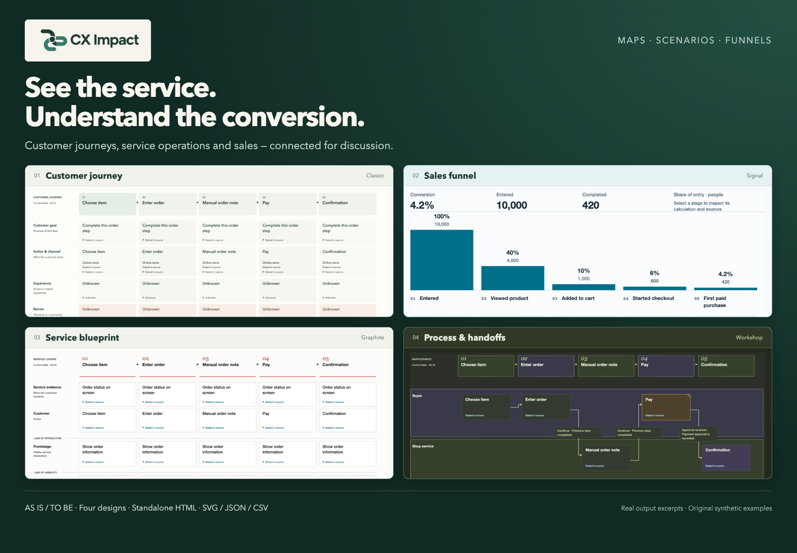

<p align="center"></p>
<p align="center"><sub>Real output excerpts, composed from original synthetic examples.</sub></p>

<h1 align="center">See the service. Understand the conversion.</h1>
<p align="center">Customer journeys, service blueprints, processes and sales funnels — in one portable agent skill.</p>
<p align="center">
  <a href="https://github.com/shelasmax/cx-impact/releases/tag/v0.6.1"></a>
  <a href="LICENSE"></a>
  <a href="https://github.com/shelasmax/cx-impact/actions/workflows/checks.yml"></a>
</p>
<p align="center"><a href="#quick-start">Quick start</a> · <a href="https://github.com/shelasmax/cx-impact/releases/download/v0.6.1/cx-impact-0.6.1-showcase.zip">Offline demos</a> · <a href="docs/releases/v0.6.1.en.md">Product guide & screenshots</a> · <a href="README.ru.md">Русский</a></p>

**CX Impact** helps product managers, analysts, designers and service teams turn scattered product knowledge into something they can discuss together. Give your coding agent a description, requirements, research, process documents or relevant code. For a funnel, add counts and measurement definitions. The skill creates interactive maps and charts with sources, assumptions and unknowns kept explicit.

Open the result in a browser, inspect a stage or handoff, compare the current and proposed service, or review conversion between sales stages. Every result is a standalone HTML file with editable JSON, static SVG export and its own rebuildable source bundle. Funnels also export numerical tables to CSV.

## One product, complementary views

| View | What it helps you discuss |
|---|---|
| **Customer journey map (CJM)** | Customer goals, actions and touchpoints; evidence about the experience, possible barriers and improvement proposals. |
| **Service blueprint** | Customer-facing work, backstage operations and supporting systems aligned to the same journey. |
| **Experience-process map** | Participants, handoffs, decision conditions, alternative paths and recovery. |
| **AS IS / TO BE comparison** | The current and proposed scenario across all three map views, with explicit correspondences and each side’s sources. Switch comparison on when needed. |
| **Sales funnel** | People at each stage, entry-to-exit and step conversion, those who did not progress within the window, supplied recovery flows and repeat purchase. |

The map views share stable stages and evidence. The funnel is a separate quantitative document: journey descriptions do not become invented conversion numbers. A supplied transition graph can show payment retries, explicitly classified losses, pending cases and unknown outcomes; repeat purchase uses its own mature cohort.

### Explore real output

The synthetic online-sales example runs from 10,000 people at entry to 420 first purchases. The column chart shows a **4.2%** overall conversion, with counts, previous-step conversion and the number who did not progress at each transition. Column heights remain proportional, including tiny values; missing data stays unknown.


The same product can be discussed through its customer journey, service operations and explicit current/target comparison:


[Explore all eight screenshots and usage examples](docs/releases/v0.6.1.en.md) · [Download comparison HTML](https://github.com/shelasmax/cx-impact/releases/download/v0.6.1/comparison-en.html) · [Download funnel HTML](https://github.com/shelasmax/cx-impact/releases/download/v0.6.1/funnel-en.html)

Choose **Classic**, **Graphite**, **Workshop** or **Signal**, independently of Light, Dark or System mode. Sources and calculations open by click or keyboard. Use 100% for reading and Fit for an overview; dense maps scroll inside the canvas. Optional path walkthroughs pause at branches and support reduced motion. SVG preserves the chosen appearance and the embedded CX Impact logo.

## From source material to a useful discussion

1. **Provide the material.** Describe the task, audience and current or target state. Attach source documents; for funnels, include counts, cohort dates, conversion window and counting rules.
2. **Create and inspect the result.** Ask for the views you need, open the HTML, and follow claims back to their sources. Requirements, observations, hypotheses, proposals and unknowns retain their meaning across views.
3. **Share or update it.** Share the HTML or export SVG/CSV. To revise a map, supply the previous JSON and new material. The agent keeps unchanged IDs and delivers a separate bundle with changes and unresolved contradictions, preserving the previous version.

[Three worked first-use examples](skills/cx-impact/references/quickstart.md) · [Map revision workflow](skills/cx-impact/references/maps.md#revising-a-map)

## Quick start

You need a coding agent with file and shell access, plus **Node.js 18+** to render or rebuild. Viewing the HTML needs only a browser.

Install from your project directory with the [Skills CLI](https://github.com/vercel-labs/skills), then start a fresh agent session:

```sh
npx skills add shelasmax/cx-impact --skill cx-impact
```

In Codex, start with a map:

```text
$cx-impact Map this service from the attached product documents.
Create a CJM, service blueprint and experience-process map in English.
Keep observations, requirements, hypotheses and unknowns distinct.
Show decision conditions and recovery paths. Save standalone HTML and sources.
```

Or provide measurement data for a funnel:

```text
$cx-impact Build an online-sales funnel from the attached counts and definitions.
Show stage counts, conversion and people who did not progress within the window.
Use only supplied transitions for recovery flows and explicitly classified losses.
Keep repeat purchase on its own mature denominator. Save HTML, JSON and CSV.
```

For comparison, provide both scenarios and explicit correspondences and ask to enable **Compare AS IS / TO BE**. Viewer labels support English and Russian; author the content in the desired language too.

Prefer manual installation? Extract the [skill package](https://github.com/shelasmax/cx-impact/releases/download/v0.6.1/cx-impact-0.6.1.zip) and copy the entire `cx-impact/` directory to your agent’s skill location. The renderer uses built-in Node APIs and needs no runtime packages, server, account or external rendering service. `npx` uses npm/network access for the third-party installer; model access is configured in your agent.

| Agent | Support scope |
|---|---|
| Codex | Tested local target; invoke `$cx-impact`. |
| Claude Code | Installation and `/cx-impact` invocation documented; no model-driven end-to-end test. |
| OpenCode | Local skill discovery checked; no model-driven end-to-end test. |
| DeepSeek Harness | Filesystem skill support documented; harness runtime not tested. |

[Installation, upgrades and troubleshooting](docs/installation.md) · [Инструкция на русском](docs/installation.ru.md)

## Try it without an agent

Download the [offline showcase](https://github.com/shelasmax/cx-impact/releases/download/v0.6.1/cx-impact-0.6.1-showcase.zip), extract it and open `index.html`. It includes English/Russian maps, comparisons and funnels, screenshots, source bundles and the installable skill. GitHub’s file viewer displays HTML source; download the files for interaction.

To render an included example from a checkout:

```sh
node skills/cx-impact/scripts/render-map.mjs --check skills/cx-impact/examples/funnels/online-sales.en.json
node skills/cx-impact/scripts/render-map.mjs skills/cx-impact/examples/funnels/online-sales.en.json output/funnel.html
node output/funnel.source/rebuild.mjs
```

`--check` validates structure and geometry without writing files. Each delivery contains:

```text
map.html          Standalone interactive result
map.json          Editable source data
map.checks.json   Structural and geometry diagnostics
map.source/       Exact renderer, template and runtime snapshot
  rebuild.mjs     Rebuild independently of the installed skill
```

HTML makes no network requests. Creating a map with an agent still uses that agent’s configured model provider. Keep custom map bundles separate from the installed skill when upgrading.

## Evidence and practical limits

CX Impact is an experimental public product. It helps structure a discussion; it does not establish the truth of an authored claim. Code cannot prove customer emotions, issue frequency or revenue impact. Requirements express intent, proposals remain proposals, and automated checks do not replace source review or human judgment.

Maps support 2–12 stages. Funnels count unique people in closed ordered cohorts, with up to 32 transition nodes and 48 edges; large scenarios may need separate maps. Aggregate checks cannot independently verify person identity or cohort maturity. The viewer is not a visual editor or a complete BPMN tool.

Chrome is checked at 1366×900 and 1920×1080. Other engines and screen readers are not claimed as tested. [Verification scope](docs/verification.md) · [Map format](skills/cx-impact/references/maps.md) · [Funnel format](skills/cx-impact/references/funnels.md) · [Evidence rules](skills/cx-impact/references/evidence.md)

## Contribute

Useful contributions include synthetic reproductions, clearer evidence handling, accessibility improvements and UI localization. Keep private product data out of public issues. Pilot and evaluation materials are [available for contributors](docs/pilot.md), alongside the [comparison protocol](docs/evaluation.md); they are not completed user studies.

```sh
node --test tests/*.test.mjs
python3 -B scripts/check-release.py
python3 -B scripts/build-release.py
```

[Contributing](CONTRIBUTING.md) · [Report a bug](https://github.com/shelasmax/cx-impact/issues/new/choose) · [Changelog](CHANGELOG.md) · [Security](SECURITY.md)

## License and references

[MIT](LICENSE). Original renderer, fixtures and project materials. [Archify](https://github.com/tt-a1i/archify), [OpenDiagram](https://github.com/Itz-Agasta/OpenDiagram), [NN/g](https://www.nngroup.com/articles/service-blueprints-definition/) and [XP Mapping](https://github.com/Byndyusoft/xp-mapping) inform visual and conceptual choices; their code/templates are not runtime dependencies. See [brand and screenshot provenance](docs/brand/README.md).
