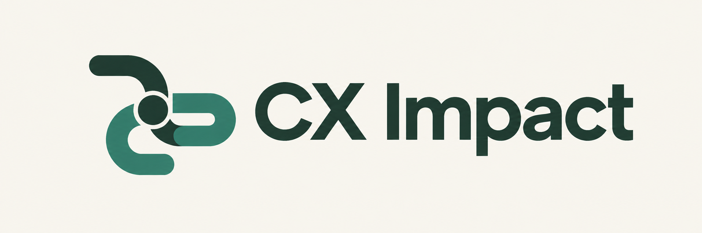
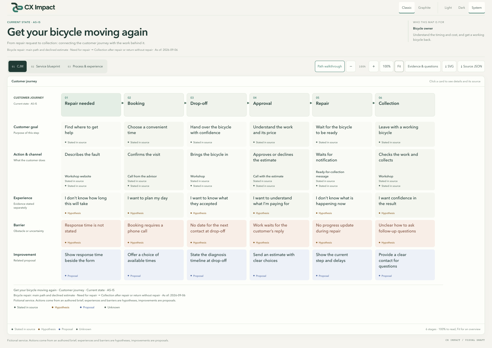
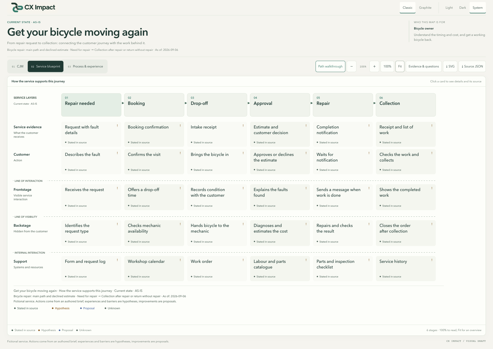
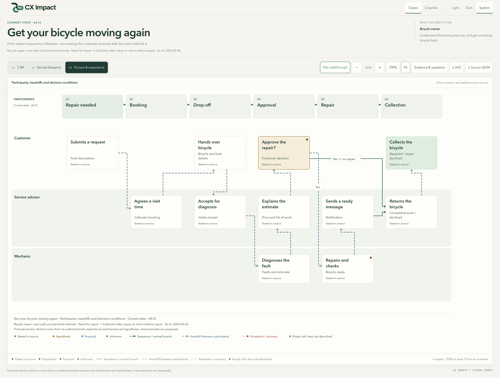

<p align="center">
  
</p>

<h1 align="center">Turn a service description into a map you can discuss.</h1>

<p align="center">
  An open-source agent skill for customer journeys, service blueprints and experience-process maps.
</p>

<p align="center">
  <a href="https://github.com/shelasmax/cx-impact/releases/tag/v0.3.1"></a>
  <a href="LICENSE"></a>
  <a href="https://github.com/shelasmax/cx-impact/actions/workflows/checks.yml"></a>
  
</p>

<p align="center">
  <a href="#quick-start">Quick start</a> ·
  <a href="https://github.com/shelasmax/cx-impact/releases/download/v0.3.1/bicycle-service-demo-en.html">Download interactive demo</a> ·
  <a href="docs/installation.md">Installation</a> ·
  <a href="README.ru.md">Русский</a>
</p>

CX Impact helps product engineers, designers and service teams connect what a customer does with the work a service needs to perform. Give your coding agent a product description, documents, research or relevant code. It produces a standalone interactive HTML map, editable JSON and SVG exports.

**One scenario. Three complementary views. Clear boundaries between evidence and assumptions.**

## What you get

Choose between the original green **Classic** design (default) and the new **Graphite Field Notes** design. Each supports Light, Dark and System modes, plus finite path walkthroughs with explicit branch choices. SVG exports preserve the selected appearance. See the [design specification](docs/brand/README.md#graphite-field-notes--map-viewer).

| View | The question it helps answer |
|---|---|
| **Customer journey map** | What is the customer trying to do, through which touchpoints, and where might the experience break down? |
| **Service blueprint** | What visible work, backstage work and support make that journey possible? |
| **Experience-process map** | Who does what, what gets handed over, and what happens at a decision or recovery step? |

Choose a **current state (AS-IS)** or **target state (TO-BE)**. Compare them when you explicitly need both. Shared stage and barrier IDs keep the views connected; requirements, observations, hypotheses, proposals and unknowns retain their meaning.

## Bicycle workshop: one scenario, three maps

An original fictional example, with English content and interface. Experiences and barriers are hypotheses; improvements are proposals. Click a screenshot to inspect it at full size.

### 1. Customer journey map (CJM)

The customer's goals, actions, touchpoints, possible barriers and improvement ideas across six stages.



### 2. Service blueprint

Customer-facing interactions, backstage work and supporting systems, aligned to the same journey.



### 3. Experience-process map

Customer, service advisor and mechanic: handoffs, repair approval, and the alternative path when the estimate is declined.



[Download the English interactive demo](https://github.com/shelasmax/cx-impact/releases/download/v0.3.1/bicycle-service-demo-en.html) · [Editable JSON](examples/bicycle-service-en/map.json) · [Russian example](README.ru.md#веломастерская-три-карты-одного-сценария)

## Quick start

**You need:** a local Codex environment and Node.js 18+ for rendering. The renderer uses only built-in Node APIs. The generated HTML needs only a browser.

1. Download and extract [cx-impact-0.3.1.zip](https://github.com/shelasmax/cx-impact/releases/download/v0.3.1/cx-impact-0.3.1.zip).
2. Copy the extracted `cx-impact` directory into **your project's** `.agents/skills/` directory. Preserve an existing installation before upgrading.
3. Start a new Codex session in that project and invoke the skill:

```text
$cx-impact Create a target-state CJM, service blueprint and experience-process
map for booking and attending a class. Use this project's product documents.
Keep requirements separate from assumptions. Show barriers, recovery paths
and open questions. Save an interactive HTML map and its rebuildable sources.
```

You can start with a description alone:

```text
$cx-impact Map a bicycle repair service from the repair request to collection.
Create a clearly labelled fictional example. Show the customer journey and
how staff support it. Keep unknown experience claims explicit.
```

[Installation, upgrades and troubleshooting →](docs/installation.md)

## Try the output without an agent

Download the [interactive bicycle-service demo](https://github.com/shelasmax/cx-impact/releases/download/v0.3.1/bicycle-service-demo-en.html), save it and open it in a browser. No server or account is needed to view it. GitHub's repository file viewer shows HTML source; use the downloaded file for interaction.

The viewer includes view switching, readable **100%** scale, **fit to width**, canvas scrolling, keyboard-accessible details, sources, open questions and full-view SVG export. Dense branch labels may move to a numbered list below the map; their full text is retained.

To render the included source yourself, from a repository checkout:

```sh
node skills/cx-impact/scripts/render-map.mjs examples/bicycle-service-en/map.json examples/bicycle-service-en/map.html
```

Each delivery includes:

```text
map.html          Standalone interactive map
map.json          Editable source data
map.checks.json   Structural and geometry check results
map.source/       Exact renderer, template and runtime snapshot
  rebuild.mjs     Reproduce this map without the installed skill
```

The HTML viewer makes no network requests. Creating a map with an agent uses that agent's configured model provider; this is not a claim of offline inference.

## Evidence before decoration

A repository can show implementation, but cannot establish how customers feel, how often a problem occurs or how it affects revenue. A requirement describes intent, not proof of working behavior. CX Impact makes those boundaries visible instead of filling every cell with confident guesses.

It also preserves missing information: an empty process cell means a step is not described; an unknown barrier does not become a hypothesis when switching views. Improvements and proposed recovery remain proposals.

[Data format and authoring guidance](skills/cx-impact/references/maps.md) · [Evidence rules](skills/cx-impact/references/evidence.md)

## Status and limitations

**v0.3.1 is an experimental public preview.** Local use is oriented toward Codex. Claude Code is a portability target and has not been tested.

- Viewer labels support English and Russian (`locale: "en"` or `"ru"`). Authored map content is not automatically translated.
- Maps support 2–12 stages and one process node per participant lane and stage. Complex journeys may need separate maps.
- The viewer is not a drag-and-drop editor, a complete BPMN tool or a full implementation of XP Mapping.
- Automated checks help find geometry and data errors. They do not establish semantic correctness or universal layout quality.
- This release does not demonstrate that the skill outperforms a short prompt.

[Verification scope](docs/verification.md) · [Changelog](CHANGELOG.md) · [Regression examples](examples/regressions/README.md)

## Contribute

Useful contributions include small synthetic reproductions of layout problems, clearer evidence handling, accessibility improvements and UI localization. Please keep private product data out of public issues.

```sh
node --test tests/*.test.mjs
python3 -B scripts/check-release.py
python3 -B scripts/build-release.py
```

[Contributing](CONTRIBUTING.md) · [Report a bug](https://github.com/shelasmax/cx-impact/issues/new/choose) · [Security](SECURITY.md)

## License and acknowledgements

[MIT](LICENSE). Original renderer, template, fixtures and project materials.

[Archify](https://github.com/tt-a1i/archify) and [OpenDiagram](https://github.com/Itz-Agasta/OpenDiagram) inspired the care given to visual delivery. [NN/g's service blueprint guidance](https://www.nngroup.com/articles/service-blueprints-definition/) informs the layer distinctions. [XP Mapping](https://github.com/Byndyusoft/xp-mapping) is background for connecting experience and process. Their code and templates are not bundled dependencies. The project logo was created with AI assistance; see [brand assets](docs/brand/README.md).
