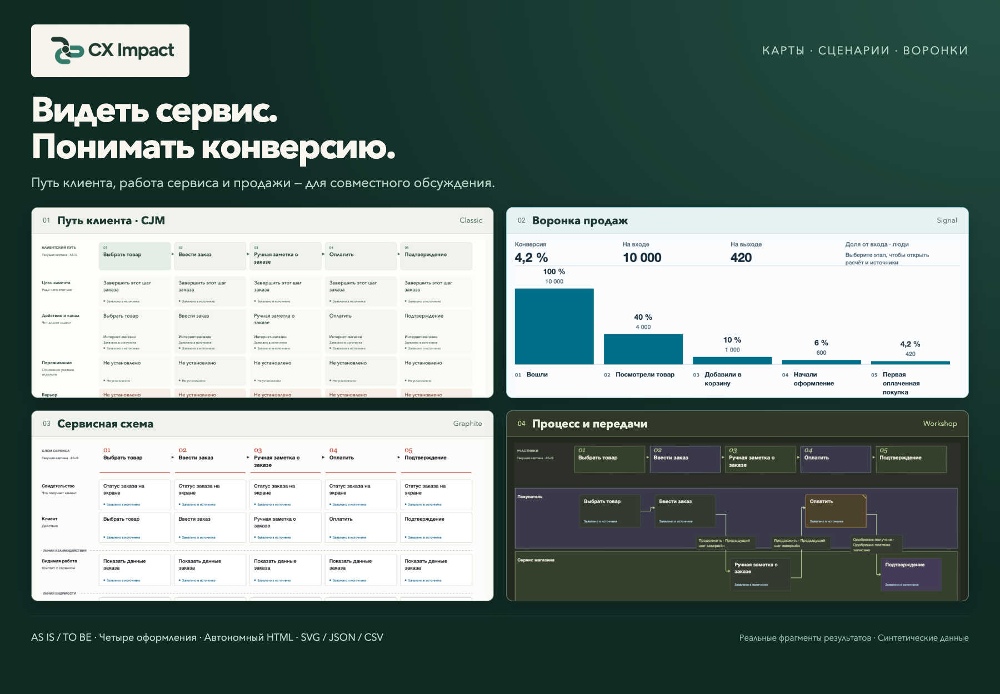
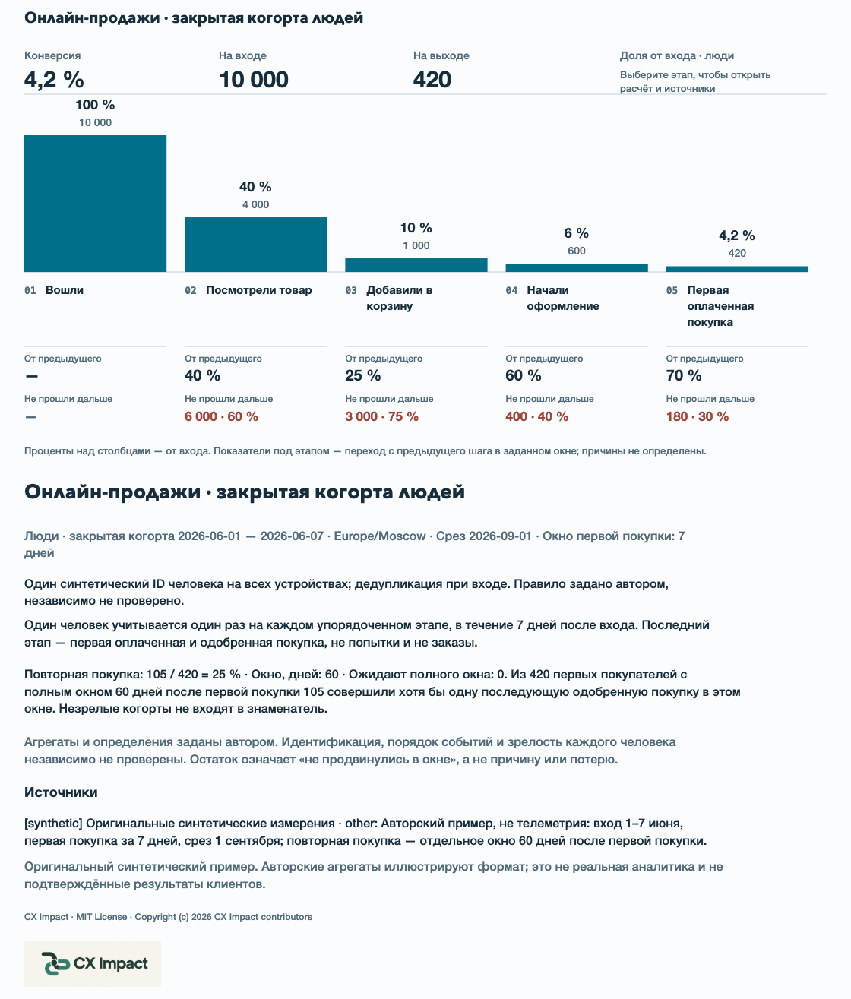
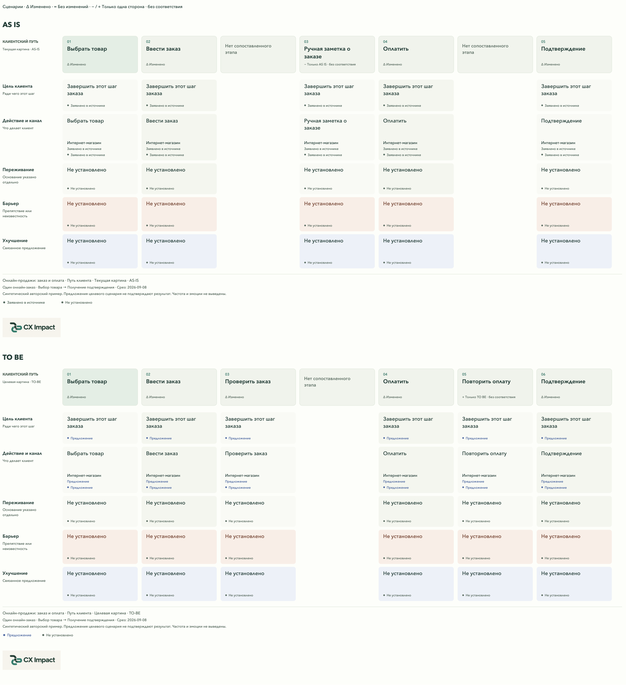

<p align="center"></p>
<p align="center"><sub>Композиция из реальных фрагментов результатов на синтетических данных.</sub></p>

<h1 align="center">Видеть сервис. Понимать конверсию.</h1>
<p align="center">Карты пути клиента, сервисные схемы, процессы и воронки продаж — в одном переносимом скилле для агента.</p>
<p align="center">
  <a href="https://github.com/shelasmax/cx-impact/releases/tag/v0.6.1"></a>
  <a href="LICENSE"></a>
  <a href="https://github.com/shelasmax/cx-impact/actions/workflows/checks.yml"></a>
</p>
<p align="center"><a href="#быстрый-старт">Быстрый старт</a> · <a href="https://github.com/shelasmax/cx-impact/releases/download/v0.6.1/cx-impact-0.6.1-showcase.zip">Автономные примеры</a> · <a href="docs/releases/v0.6.1.ru.md">Описание и скриншоты</a> · <a href="README.md">English</a></p>

**CX Impact** помогает продактам, аналитикам, дизайнерам и сервисным командам собрать разрозненные сведения о продукте в материал для совместного обсуждения. Передайте агенту описание, требования, исследования, документы процесса или доступный код. Для воронки добавьте числа и определения метрик. Скилл создаст интерактивные карты и диаграммы, сохранив источники, гипотезы и неизвестные.

Откройте результат в браузере, разберите этап или передачу между участниками, сравните текущий и предлагаемый сервис либо проверьте конверсии между этапами продаж. Каждый результат — автономный HTML, редактируемый JSON, статический SVG и собственный комплект исходников для пересборки. Числа воронки также экспортируются в CSV.

## Один продукт, взаимосвязанные представления

| Представление | Что помогает обсудить |
|---|---|
| **Карта пути клиента — CJM** | Цели, действия и точки контакта; сведения об опыте, возможные барьеры и предложения по улучшению. |
| **Сервисная схема — Service blueprint** | Видимая клиенту работа, внутренние операции и поддерживающие системы, связанные с тем же путём. |
| **Карта процесса-опыта** | Участники, передачи, условия решений, альтернативные пути и восстановление после проблем. |
| **Сравнение AS IS / TO BE** | Текущий и предлагаемый сценарии во всех трёх видах карт, с явными соответствиями и источниками каждой стороны. Сравнение включается по необходимости. |
| **Воронка продаж** | Люди на каждом этапе, общая и пошаговая конверсия, не прошедшие дальше в заданном окне, заданные потоки восстановления и повторная покупка. |

Представления карты связаны стабильными этапами и основаниями. Воронка — отдельный количественный документ: описание пути клиента не превращается в придуманные конверсии. Заданный граф переходов может показывать повторные попытки оплаты, заданные потери, ожидание и неизвестные исходы; у повторной покупки своя зрелая когорта.

### Посмотрите реальные результаты

Синтетический пример онлайн-продаж начинается с 10 000 человек и заканчивается 420 первыми покупками. Столбцы показывают **4,2%** общей конверсии, количества, переход с предыдущего шага и не прошедших дальше на каждом переходе. Высота остаётся пропорциональной даже при очень малых значениях; пропуски остаются неизвестными.



Тот же продукт можно обсудить через путь клиента, работу сервиса и явное сравнение текущего и целевого сценариев:



[Восемь скриншотов и примеры запросов](docs/releases/v0.6.1.ru.md) · [Скачать HTML сравнения](https://github.com/shelasmax/cx-impact/releases/download/v0.6.1/comparison-ru.html) · [Скачать HTML воронки](https://github.com/shelasmax/cx-impact/releases/download/v0.6.1/funnel-ru.html)

Выберите **Classic**, **Graphite**, **Workshop** или **Signal**, независимо от светлого, тёмного или системного режима. Источники и расчёты открываются мышью и клавиатурой. Масштаб 100% предназначен для чтения, «Вписать» — для обзора; большие карты прокручиваются внутри холста. Необязательный обзор пути останавливается на развилках и учитывает настройку уменьшения движения. SVG сохраняет оформление и встроенный логотип CX Impact.

## От материалов к полезному обсуждению

1. **Передайте исходные сведения.** Опишите задачу, аудиторию и текущий или целевой сценарий. Приложите документы; для воронки — числа, даты когорты, окно конверсии и правила подсчёта.
2. **Создайте и проверьте результат.** Запросите нужные представления, откройте HTML и проследите утверждения до источников. Требования, наблюдения, гипотезы, предложения и неизвестные сохраняют смысл между видами.
3. **Поделитесь или обновите.** Отправьте HTML либо экспортируйте SVG/CSV. Для обновления карты передайте прежний JSON и новые сведения. Агент сохранит ID неизменившихся элементов и создаст отдельный комплект со списком изменений и нерешённых противоречий; предыдущая версия останется доступной.

[Три примера первого использования](skills/cx-impact/references/quickstart.ru.md) · [Порядок обновления карты](skills/cx-impact/references/maps.md#revising-a-map)

## Быстрый старт

Для создания и пересборки нужны агент с доступом к файлам и терминалу и **Node.js 18+**. Для просмотра HTML достаточно браузера.

Установите скилл из папки проекта через [Skills CLI](https://github.com/vercel-labs/skills), затем начните новую сессию агента:

```sh
npx skills add shelasmax/cx-impact --skill cx-impact
```

В Codex можно начать с карты:

```text
$cx-impact Построй карту сервиса по приложенным документам продукта.
Создай CJM, сервисную схему и карту процесса-опыта на русском.
Разделяй наблюдения, требования, гипотезы и неизвестные.
Покажи условия решений и восстановление. Сохрани автономный HTML и исходники.
```

Или передать измерения для воронки:

```text
$cx-impact Построй воронку онлайн-продаж по приложенным числам и определениям.
Покажи количества, конверсии и не прошедших дальше в заданном окне.
Для восстановления и заданных потерь используй только заданные переходы.
У повторной покупки оставь свой зрелый знаменатель. Сохрани HTML, JSON и CSV.
```

Для сравнения передайте оба сценария и явные соответствия и попросите включить **Сравнить AS IS / TO BE**. Интерфейс поддерживает русский и английский; содержание тоже нужно создавать на выбранном языке.

Для ручной установки распакуйте [пакет скилла](https://github.com/shelasmax/cx-impact/releases/download/v0.6.1/cx-impact-0.6.1.zip) и скопируйте целиком каталог `cx-impact/` в папку скиллов агента. Рендерер использует встроенные API Node, не требует дополнительных runtime-пакетов, сервера, аккаунта или внешнего сервиса отрисовки. `npx` использует npm и сеть для стороннего установщика; доступ к модели настраивается в агенте.

| Агент | Объём поддержки |
|---|---|
| Codex | Проверенная локальная среда; вызов `$cx-impact`. |
| Claude Code | Установка и вызов `/cx-impact` описаны по документации; сквозной тест с моделью не проводился. |
| OpenCode | Проверено локальное обнаружение скилла; сквозной тест с моделью не проводился. |
| DeepSeek Harness | Описана файловая установка; работа harness не проверялась. |

[Установка, обновление и устранение проблем](docs/installation.ru.md) · [English guide](docs/installation.md)

## Попробовать без агента

Скачайте [автономный комплект](https://github.com/shelasmax/cx-impact/releases/download/v0.6.1/cx-impact-0.6.1-showcase.zip), распакуйте и откройте `index.html`. Внутри — карты, сравнения и воронки на двух языках, скриншоты, комплекты исходников и установочный пакет. GitHub показывает исходный код HTML; для интерактивного просмотра скачайте файлы.

Чтобы самостоятельно собрать пример из репозитория:

```sh
node skills/cx-impact/scripts/render-map.mjs --check skills/cx-impact/examples/funnels/online-sales.ru.json
node skills/cx-impact/scripts/render-map.mjs skills/cx-impact/examples/funnels/online-sales.ru.json output/funnel.html
node output/funnel.source/rebuild.mjs
```

`--check` проверяет структуру и геометрию без записи файлов. Каждый комплект содержит:

```text
map.html          Автономный интерактивный результат
map.json          Редактируемые исходные данные
map.checks.json   Диагностика структуры и геометрии
map.source/       Точный снимок рендерера, шаблона и runtime
  rebuild.mjs     Пересборка независимо от установленного скилла
```

HTML не делает сетевых запросов. Создание карты агентом использует выбранного в нём провайдера модели. При обновлении скилла храните пользовательские комплекты карт отдельно от установки.

## Основания и практические ограничения

CX Impact — экспериментальный публичный продукт. Он помогает организовать обсуждение, но не доказывает истинность заданных утверждений. Код не подтверждает переживания клиентов, частоту проблем и влияние на выручку. Требования описывают намерение, предложения остаются предложениями; автоматические проверки не заменяют работу с источниками и оценку человеком.

Карты поддерживают 2–12 этапов. Воронки считают уникальных людей в закрытых упорядоченных когортах, с графом до 32 узлов и 48 переходов; большие сценарии может потребоваться разделить. Агрегаты не позволяют независимо проверить идентификацию людей и зрелость когорт. Просмотрщик не является визуальным редактором или полной реализацией BPMN.

Chrome проверяется на 1366×900 и 1920×1080. Другие движки и скринридеры не заявлены как проверенные. [Объём проверок](docs/verification.md) · [Формат карт](skills/cx-impact/references/maps.md) · [Формат воронки](skills/cx-impact/references/funnels.ru.md) · [Правила работы с основаниями](skills/cx-impact/references/evidence.md)

## Участие в развитии

Полезны синтетические воспроизведения ошибок, улучшения работы с источниками, доступности и локализации. Не публикуйте частные данные продукта в issues. Для участников доступны [материалы пилота](docs/pilot.ru.md) и [протокол сравнения](docs/evaluation.ru.md); это не завершённые исследования пользователей.

```sh
node --test tests/*.test.mjs
python3 -B scripts/check-release.py
python3 -B scripts/build-release.py
```

[Участие в разработке](CONTRIBUTING.md) · [Сообщить об ошибке](https://github.com/shelasmax/cx-impact/issues/new/choose) · [История изменений](CHANGELOG.md) · [Безопасность](SECURITY.md)

## Лицензия и источники идей

[MIT](LICENSE). Рендерер, примеры и материалы проекта — оригинальные. [Archify](https://github.com/tt-a1i/archify), [OpenDiagram](https://github.com/Itz-Agasta/OpenDiagram), [NN/g](https://www.nngroup.com/articles/service-blueprints-definition/) и [XP Mapping](https://github.com/Byndyusoft/xp-mapping) повлияли на визуальные и смысловые решения; их код и шаблоны не являются runtime-зависимостями. [Происхождение графики и скриншотов](docs/brand/README.md).
