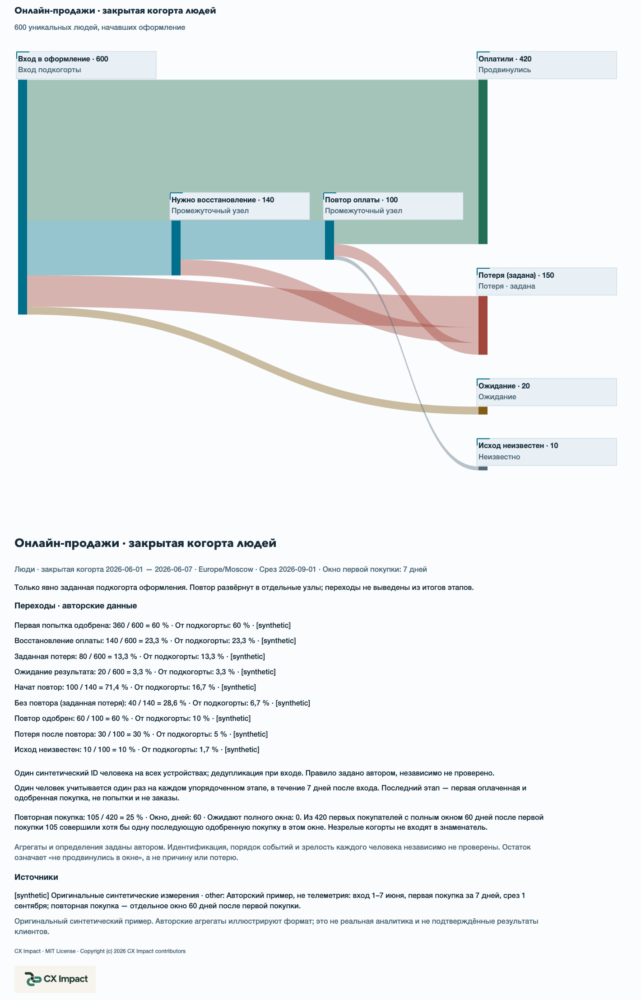
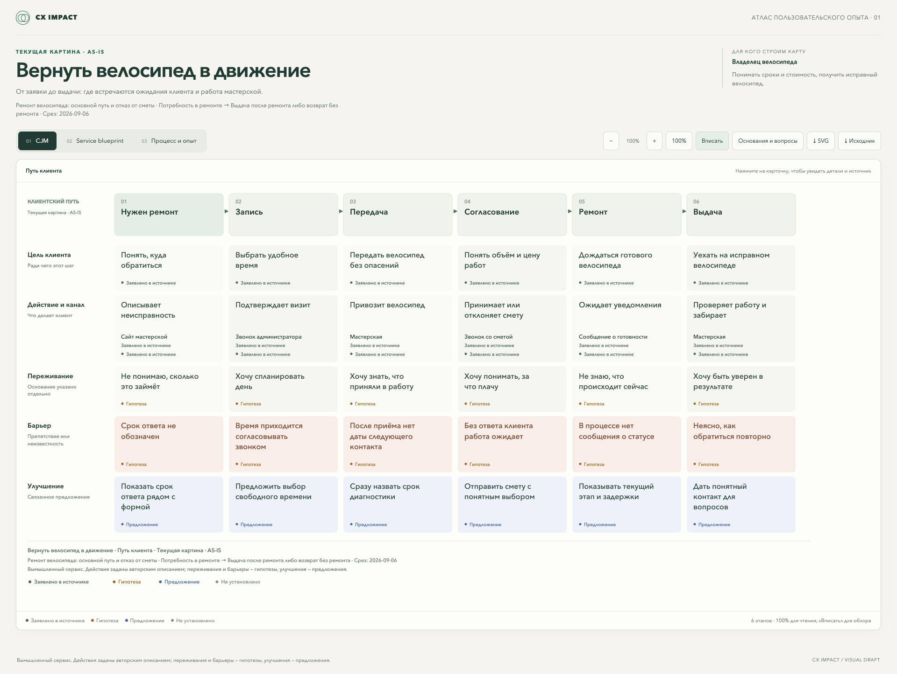
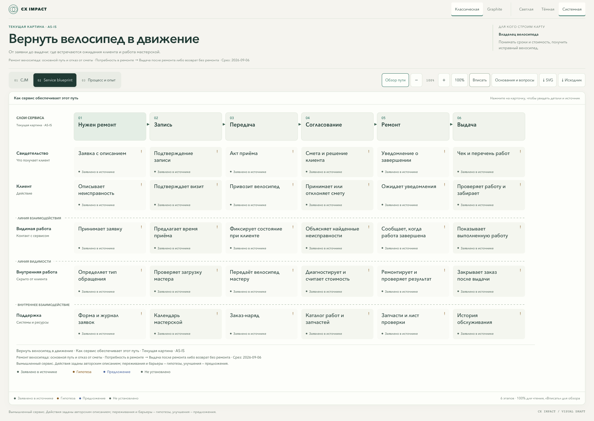
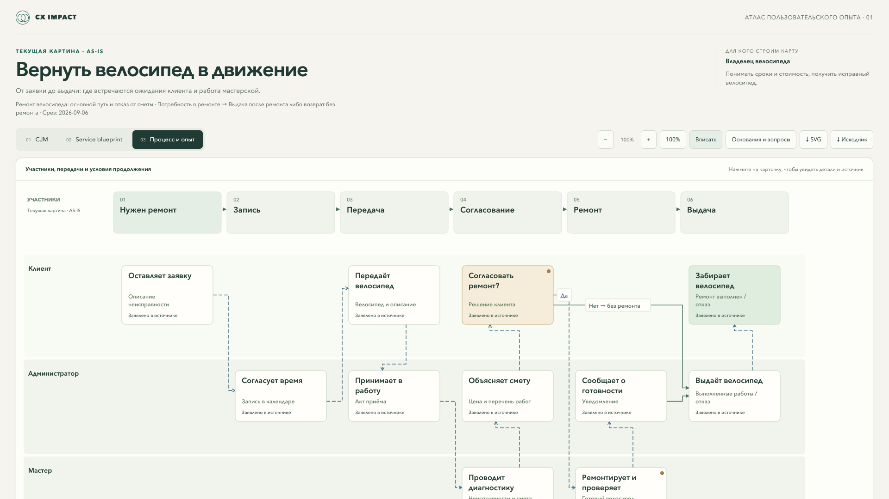

<p align="center"></p>
<p align="center"><sub>Промоиллюстрация. Реальные результаты рендерера показаны ниже.</sub></p>

# Описать сервис → увидеть путь клиента и работу за ним

**CX Impact** — открытый скилл для Codex, Claude Code, OpenCode и DeepSeek Harness, который создаёт CJM, service blueprint и карту процесса-опыта по описанию продукта, документам, исследованиям и доступному коду.

[English](README.md) · [Релиз v0.6.0](https://github.com/shelasmax/cx-impact/releases/tag/v0.6.0) · [Скачать интерактивный пример](https://github.com/shelasmax/cx-impact/releases/download/v0.6.0/bicycle-service-demo.html)

## Новое в v0.6.0: сценарии, воронка и четыре дизайна

Сравнение включается явно кнопкой **Сравнить AS IS / TO BE**. Задайте текущий и целевой сценарии и соответствия этапов, узлов и дорожек. Поддерживаются разделение одного элемента на несколько и элементы без соответствия; автоматического сопоставления нет. Детали сохраняют источники каждой стороны. Парный SVG содержит обе карты вертикально; выключение сравнения возвращает обычный просмотр.

Воронка продаж — отдельный документ (`kind: "sales-funnel"`) с видами «Этапы», «Потоки» и «Таблица». Единица — уникальные люди в закрытой упорядоченной когорте. Пропуски остаются неизвестными; остаток между этапами не доказывает потерю. Потоки требуют заданного ограниченного DAG с балансом чисел, развёрнутыми повторами и проверенной геометрией. У повторной покупки свой зрелый знаменатель. Агрегаты не доказывают корректность идентификации и индивидуальных окон; денежные эффекты не выводятся. JSON воронки сохраняет точные исходные байты, CSV — числа и знаменатели; SVG доступен для визуальных видов.

Classic остаётся по умолчанию. Graphite, Workshop и Signal поддерживают независимые светлый, тёмный и системный режимы. Прохождение пути выключено при открытии и учитывает уменьшение движения. «Вписать» даёт обзор; подробности читайте при 100% с прокруткой холста.

```sh
node skills/cx-impact/scripts/render-map.mjs skills/cx-impact/examples/scenarios/online-sales.ru.json output/comparison.html
node skills/cx-impact/scripts/render-map.mjs skills/cx-impact/examples/funnels/online-sales.ru.json output/funnel.html
```

[Контракт воронки](skills/cx-impact/references/funnels.ru.md) · [Проверки и ограничения](docs/verification.md). Все примеры синтетические. [Описание релиза и восемь скриншотов](docs/releases/v0.6.0.ru.md) · [Автономный комплект](https://github.com/shelasmax/cx-impact/releases/download/v0.6.0/cx-impact-0.6.0-showcase.zip).

### Сравнить изменения и посмотреть числа

Полная парная CJM в Classic, экспортированная из русского синтетического сценария:


Восстановление оплаты в Signal; ширина потоков соответствует заданным числам:



[Все восемь русских скриншотов, четыре дизайна и примеры запросов](docs/releases/v0.6.0.ru.md) · [HTML сравнения](https://github.com/shelasmax/cx-impact/releases/download/v0.6.0/comparison-ru.html) · [HTML воронки](https://github.com/shelasmax/cx-impact/releases/download/v0.6.0/funnel-ru.html)

## Три вида одного сценария

- **CJM:** этапы, цели и действия клиента, каналы, переживания, барьеры и улучшения.
- **Service blueprint:** видимая работа сервиса, внутренняя работа и поддержка, связанные с теми же этапами.
- **Карта процесса-опыта:** участники, действия, передачи, решения и восстановление после проблем.

Режим карты задаётся явно: текущая картина **AS-IS**, целевая **TO-BE** или отдельно запрошенное сравнение. Требования, наблюдения, гипотезы, предложения и неизвестные различаются текстом и сохраняют статус между видами.

## Веломастерская: три карты одного сценария

Вымышленный пример с русскими подписями и интерфейсом. Переживания и барьеры — гипотезы, улучшения — предложения. Нажмите на скриншот, чтобы рассмотреть его в полном размере.

### 1. Карта пути клиента — CJM

Цели, действия, каналы, возможные барьеры и идеи улучшений на шести этапах ремонта.



### 2. Сервисная схема — Service Blueprint

Видимая работа мастерской, внутренние действия и поддерживающие системы, связанные с теми же этапами.



### 3. Карта процесса-опыта

Клиент, администратор и мастер: передачи, согласование сметы и отдельный путь возврата без ремонта.



[Скачать русский интерактивный пример](https://github.com/shelasmax/cx-impact/releases/download/v0.6.0/bicycle-service-demo.html) · [Редактируемый JSON](examples/bicycle-service/map.json) · [English example](README.md#bicycle-workshop-one-scenario-three-maps)

## Начать

Нужны агент с доступом к файлам и командной строке и Node.js 18+. Внешние пакеты для рендерера не требуются.

В каталоге своего проекта запустите установку через [Skills CLI](https://github.com/vercel-labs/skills) и выберите агента:

```sh
npx skills add shelasmax/cx-impact --skill cx-impact
```

Для установки копий сразу в Codex, Claude Code и OpenCode:

```sh
npx skills add shelasmax/cx-impact --skill cx-impact --agent codex claude-code opencode --copy --yes
```

Начните новую сессию. В Codex используйте `$cx-impact`, в Claude Code — `/cx-impact`, в OpenCode попросите использовать скилл `cx-impact`. Пример для Codex:

```text
$cx-impact Создай целевую CJM, service blueprint и карту процесса-опыта
записи на занятие. Используй документы проекта. Разделяй требования,
гипотезы и неизвестные. Покажи барьеры, восстановление и открытые вопросы.
Сохрани интерактивный HTML и комплект для пересборки.
```

Для ручной установки скачайте [cx-impact-0.6.0.zip](https://github.com/shelasmax/cx-impact/releases/download/v0.6.0/cx-impact-0.6.0.zip) и скопируйте весь каталог скилла в каталог навыков своего агента. Для `npx` нужны npm и интернет: он запускает сторонний установщик. Отдельный npm-пакет CX Impact не нужен.

| Агент | Статус поддержки |
|---|---|
| Codex | Проверенная локальная среда; установка в `.agents/skills/`. |
| Claude Code | Установка и вызов `/cx-impact` по официальной документации; полный запуск с моделью не проверялся. |
| OpenCode | Обнаружение скилла проверено локально; полный запуск с моделью не проверялся. |
| DeepSeek Harness | Подключение через файловую систему описано по документации; запуск в harness не проверялся. |

[Установка для каждого агента, DeepSeek Harness и обновление →](docs/installation.ru.md)

Можно начать с описания идеи; Git diff и исследования клиентов не обязательны. Недостаток данных нужно обозначать, а не заполнять выдуманными фактами.

## Что получится

Выбирайте зелёный **Classic** (по умолчанию), **Graphite Field Notes**, **Workshop** или **Signal**. В каждом доступны светлый, тёмный и системный режимы, а также конечный анимированный обзор пути с выбором ветвей. SVG сохраняет выбранное оформление и содержит актуальный логотип CX Impact, встроенный для автономного просмотра. JSON сохраняет исходные данные. [Правила дизайна](docs/brand/README.md#graphite-field-notes--map-viewer).

Автономный HTML с переключением видов, масштабом 100%, настоящим «Вписать», прокруткой полотна, деталями и источниками. SVG содержит весь активный вид, включая режим и легенду. JSON остаётся редактируемым, а каталог `.source/` позволяет воспроизвести карту с тем же шаблоном.

[Интерактивный пример](https://github.com/shelasmax/cx-impact/releases/download/v0.6.0/bicycle-service-demo.html) нужно скачать и открыть в браузере. GitHub показывает исходный HTML, а не работающий viewer. Пример вымышленный; он не описывает реальных клиентов.

Сам HTML не делает сетевых запросов. Агент при создании карты использует настроенного провайдера модели.

## Первый запуск и обновление карт

В версию 0.5.0 включены [три подробных примера](skills/cx-impact/references/quickstart.ru.md) для продактов и аналитиков: целевой сервис из требований, текущий процесс из документов и обновление карты. В каждом есть вымышленные исходные материалы, запрос, авторский JSON и ограничения. [English guide](skills/cx-impact/references/quickstart.md). Оба руководства, JSON-примеры и команда `--check` входят в архив релиза.

Проверить JSON без записи файлов: `node skills/cx-impact/scripts/render-map.mjs --check path/to/map.json`. [Правила обновления](skills/cx-impact/references/maps.md#revising-a-map) описывают сохранение ID, источников и прежнего комплекта карты.

Фокус развития — самостоятельный первый результат и повторное использование: [пилот с пятью участниками](docs/pilot.ru.md) · [сравнение на четырёх заданиях](docs/evaluation.ru.md). Это протоколы и синтетические материалы, а не проведённое исследование или доказанное превосходство над коротким промптом. Приглашения и оценки пользователей остаются за владельцем проекта.

После первого подтверждения спроса приоритеты по порядку: сводка для решений со ссылками на основания, переходы между связанными небольшими картами и расширение браузерной совместимости в средах пользователей. Изолированные проверки и четыре оформления уже доступны. Визуальный редактор, сервер, аккаунты и интеграции остаются за пределами этого цикла. Ориентиры пилота — 4 из 5 самостоятельных первых результатов и 3 из 5 повторных использований — помогают выбрать следующий шаг, но не доказывают широкий спрос.

## Статус и ограничения

v0.6.0 — **экспериментальная версия**. Интерфейс поддерживает русский и английский: `locale: "ru"` или `"en"`. Текст самой карты задаёт автор. Используется один переносимый пакет; область проверки каждого агента указана выше. В карте 2–12 этапов, один процессный узел на полосу и этап. Перетаскивание карточек, полный BPMN и полная нотация XP Mapping не реализованы.

На плотных схемах часть условий выносится под карту с предупреждением. Проверка схемы и геометрии не заменяет просмотр результата и проверку содержания. Преимущество skill перед коротким промптом пока не доказано.

[Установка и обновление](docs/installation.ru.md) · [Формат данных](skills/cx-impact/references/maps.md) · [Проверки](docs/verification.md) · [История изменений](CHANGELOG.md) · [Вклад в проект](CONTRIBUTING.md)

Лицензия — [MIT](LICENSE). Визуальные ориентиры: [Archify](https://github.com/tt-a1i/archify) и [OpenDiagram](https://github.com/Itz-Agasta/OpenDiagram). Их код и шаблоны не включены в пакет.
