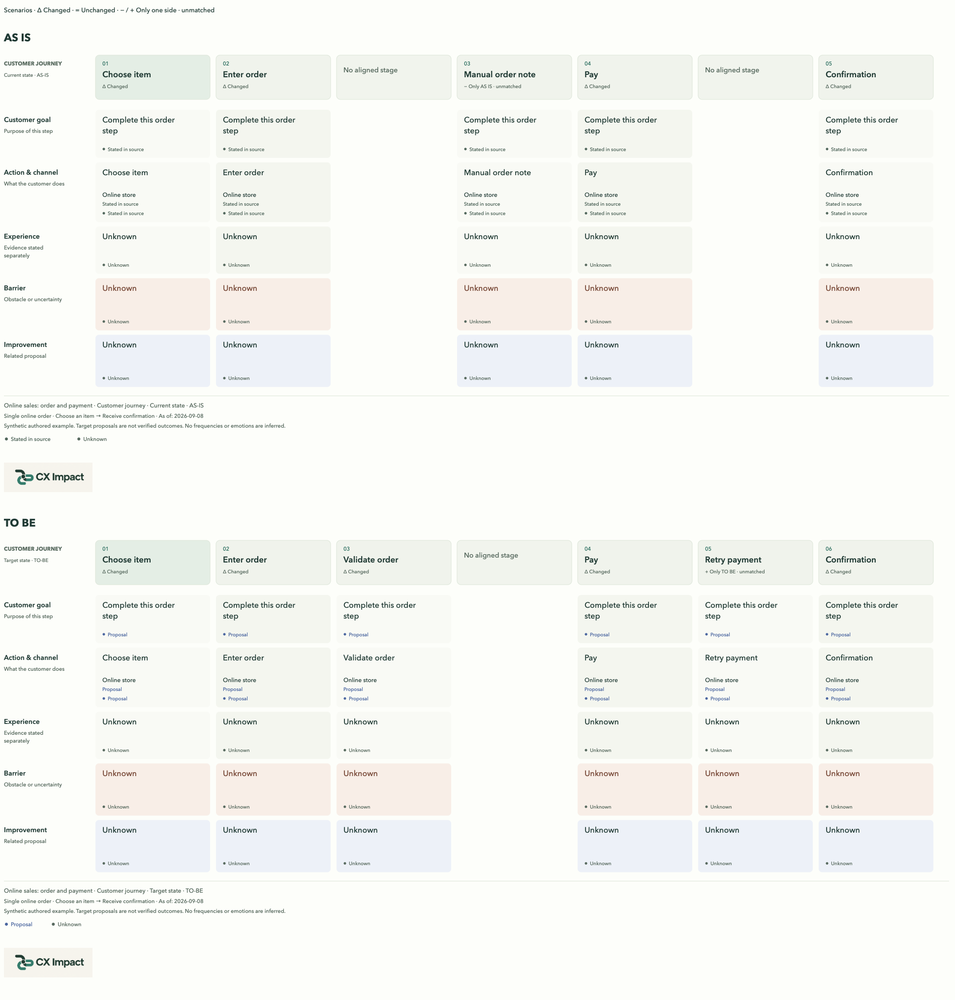
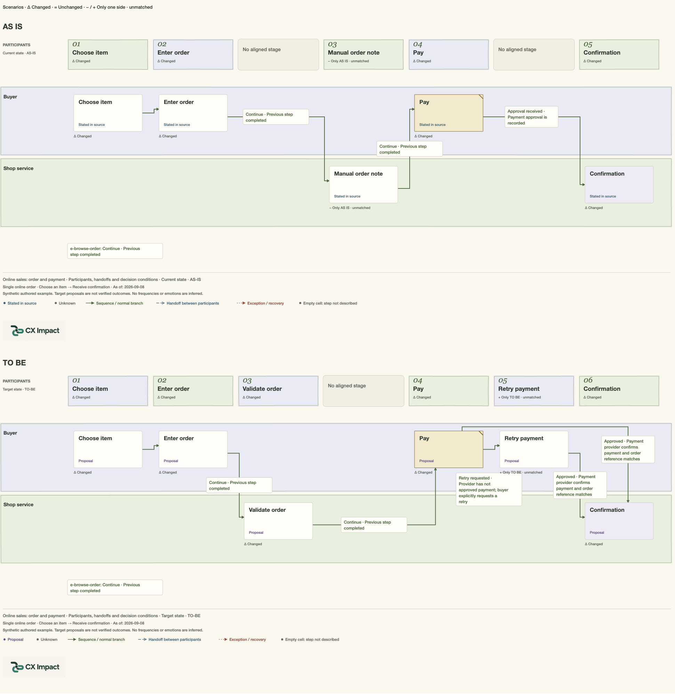
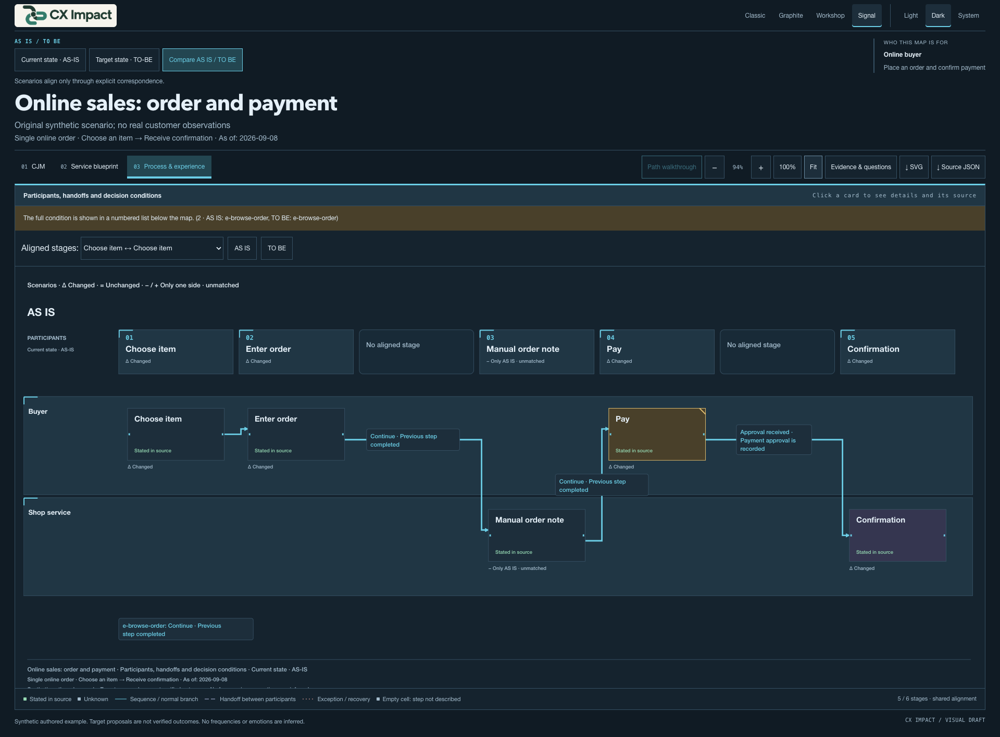
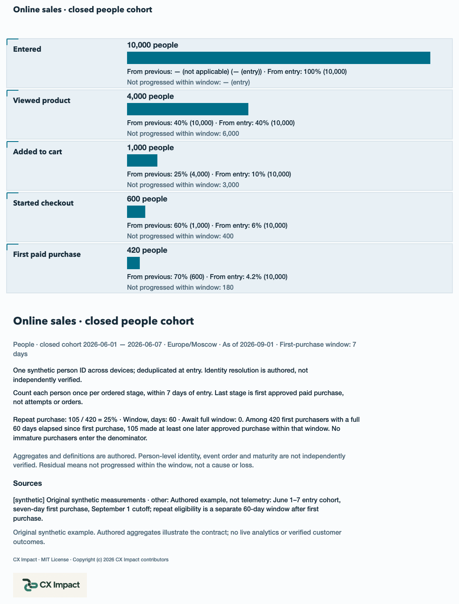
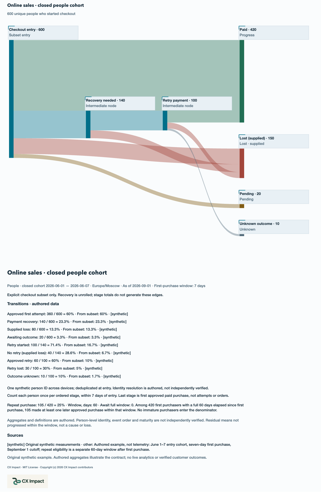
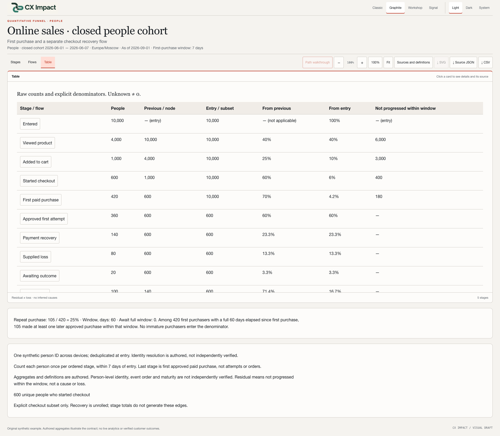
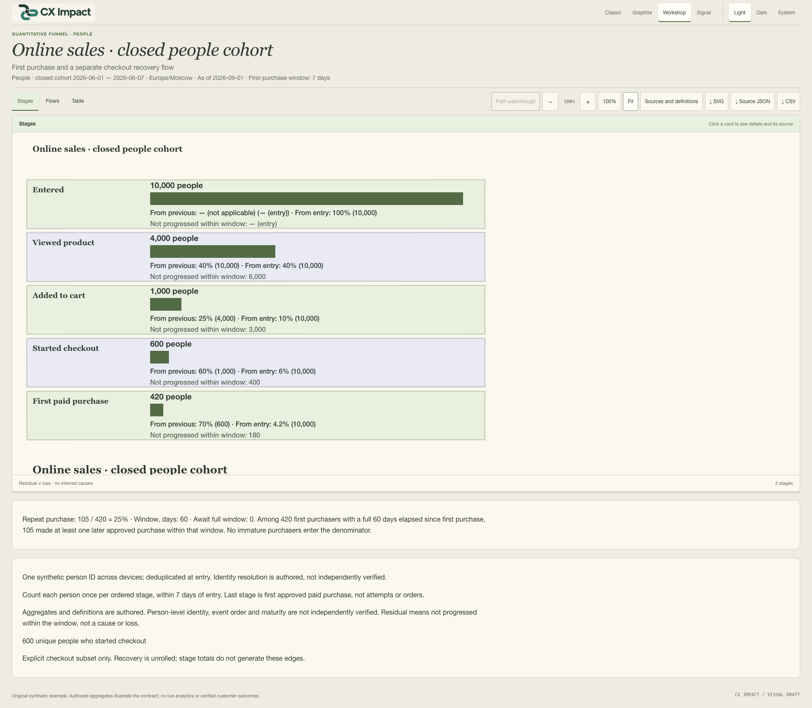

# CX Impact v0.6.0 — Compare scenarios, inspect sales flows

[Русский](v0.6.0.ru.md) · [Release and downloads](https://github.com/shelasmax/cx-impact/releases/tag/v0.6.0)

CX Impact now combines optional AS IS / TO BE comparison, a separate quantitative sales funnel and four visual designs in one portable agent skill. Existing customer journey, service blueprint and experience-process maps remain supported. HTML runs without a server; every result retains editable JSON and a standalone source snapshot.

All examples below are original synthetic material. Images are actual Chrome captures of the viewer or its complete SVG exports; they are not promotional mockups. Complete exports include content below the visible canvas. Interface captures use 1920×1080 with natural document scrolling; the canvas itself remains scrollable. Click an image for its full size.

## AS IS / TO BE: make the change explicit

Give the agent both scenarios and explicit correspondences. Enable **Compare AS IS / TO BE** to align the same stages and participants across all three map views. A stage may split into several target stages; unmatched elements remain visible. No title-based or ID-based matching is invented. Details retain each side's own claims and sources, even when a source ID has different text in the two scenarios. Turning comparison off returns to ordinary viewing.

```text
$cx-impact Compare the current checkout with the proposed checkout.
Use the attached descriptions and explicit stage/node correspondences.
Preserve unknowns, source differences and the one-to-many payment split.
Save an English comparison map and its rebuildable source bundle.
```

Set `locale: "en"` for English UI and author the map content in English. Locale does not automatically translate source material. [Comparison JSON](https://github.com/shelasmax/cx-impact/blob/v0.6.0/skills/cx-impact/examples/scenarios/online-sales.en.json) · [Download HTML](https://github.com/shelasmax/cx-impact/releases/download/v0.6.0/comparison-en.html).

### 1. Classic — complete paired customer journey

The current and proposed journey share an explicit alignment. Empty positions and unmatched stages are preserved. This is a capture of the complete exported SVG.



### 2. Graphite — complete paired service blueprint

Editorial typography and grouping rules organize customer, visible service, backstage and supporting work. The source/evidence distinctions remain unchanged. Complete SVG capture.


### 3. Workshop — complete paired process

Warm surfaces and lightly irregular group outlines support workshop discussion. Full conditions, proposed recovery and both scenarios remain in the export. Complete SVG capture.



### 4. Signal — process interface in dark mode

Crisp hierarchy, technical indexes and stronger existing route emphasis. The screenshot shows the interface and the visible portion of the scrollable paired process. Walkthrough is optional, starts off and pauses for a branch choice; animation does not encode traffic speed. Changing appearance stops the traversal.



## Sales funnel: counts, denominators and measured recovery

The new `kind: "sales-funnel"` document is separate from a journey map. The initial contract counts unique people in a closed ordered cohort. Define the cohort dates, cutoff, timezone, conversion window, identity rule and order rule. Each stage has a count or an explicit unknown plus sources. Aggregate residuals mean “not progressed within the window”; they do not prove loss or its cause.

The synthetic example has 10,000 visitors → 4,000 product interactions → 1,000 carts → 600 checkouts → 420 first purchasers. Checkout conversion is 420/600 = 70%; entry-to-purchase is 420/10,000 = 4.2%. The separately supplied recovery graph balances 420 progressed, 150 lost, 20 pending and 10 unknown. Repeat purchase is 105/420 = 25% using a mature 60-day cohort.

```text
$cx-impact Build an online-sales funnel from the attached counts and definitions.
Show stage conversion, supplied losses, pending and unknown outcomes.
Use only the provided checkout transitions; unroll payment retries.
Keep repeat purchase on its own mature denominator. Export HTML, JSON and CSV.
```

### 5. Signal — stages and conversions

Bar widths, counts and ratios derive from the same validated data. Both entry and previous-stage denominators are shown; a missing value is not zero. Complete SVG capture.



### 6. Signal — payment recovery flows

Ribbons follow measured transitions and share one scale. Retry nodes are explicitly unrolled; the graph is not inferred from stage totals. Crossing ribbons are not implicit joins. Complete SVG capture.



### 7. Graphite — numerical table

The interface table exposes raw counts and denominators for discussion. CSV is quoted and mitigates spreadsheet formulas in authored text. SVG is available for Stages and Flows; Table deliberately offers CSV instead.



### 8. Workshop — the same funnel in a different design

The viewer uses the same values and geometry in every design. Choose Classic, Graphite, Workshop or Signal independently from Light, Dark or System. This screenshot shows the scrollable interface at Fit.



## Download and use

- [Skill package](https://github.com/shelasmax/cx-impact/releases/download/v0.6.0/cx-impact-0.6.0.zip): extract and copy the complete `cx-impact/` folder into your agent's skill location.
- [Offline showcase](https://github.com/shelasmax/cx-impact/releases/download/v0.6.0/cx-impact-0.6.0-showcase.zip): extract everything and open `index.html`. Includes both languages, four interactive HTML/JSON/source bundles, these screenshots and the skill archive.
- Direct demos: [comparison](https://github.com/shelasmax/cx-impact/releases/download/v0.6.0/comparison-en.html), [funnel](https://github.com/shelasmax/cx-impact/releases/download/v0.6.0/funnel-en.html). Download first; GitHub's file viewer displays source rather than the interactive HTML.

From a repository checkout:

```sh
node skills/cx-impact/scripts/render-map.mjs --check skills/cx-impact/examples/funnels/online-sales.en.json
node skills/cx-impact/scripts/render-map.mjs skills/cx-impact/examples/funnels/online-sales.en.json output/funnel.html
node output/funnel.source/rebuild.mjs
```

Node.js 18+ is required for rendering/rebuilding; viewing needs only a browser. No new runtime dependency, account, server or rendering service. [Installation and upgrade guide](https://github.com/shelasmax/cx-impact/blob/v0.6.0/docs/installation.md).

## Compatibility, checks and limits

Map JSON stays `version: 1`. Old maps and custom source snapshots retain their previous workflow; old renderers are not expected to understand the new funnel kind. Map JSON downloads preserve complete original values; funnel JSON and adjacent source files preserve exact input bytes. Full static SVG preserves theme, source metadata, MIT notice and embedded logo.

The release is checked with the Node suite, publication allowlist, extracted-package render/rebuild and Chrome at 1366×900 and 1920×1080. The browser matrix covers both languages, four designs and light/dark, plus focused keyboard, export, comparison, recovery and storage cases. See the exact [verification scope](https://github.com/shelasmax/cx-impact/blob/v0.6.0/docs/verification.md).

Maps support 2–12 stages; the supplied funnel graph supports up to 32 nodes and 48 edges and may require splitting for readability. Aggregate checks cannot establish person-level identity, individual cohort maturity, causal loss or financial effect. Other browser engines, screen readers and human semantic acceptance are not claimed. Codex remains the tested local agent target.

Before upgrading, keep the installed package and existing map bundles. Roll back by restoring that directory or the previous v0.5.0 archive. Previous tags and release assets remain available.
