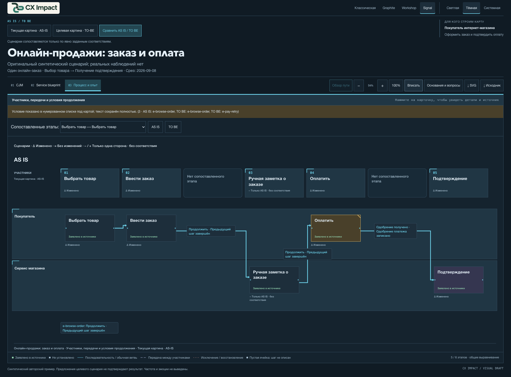
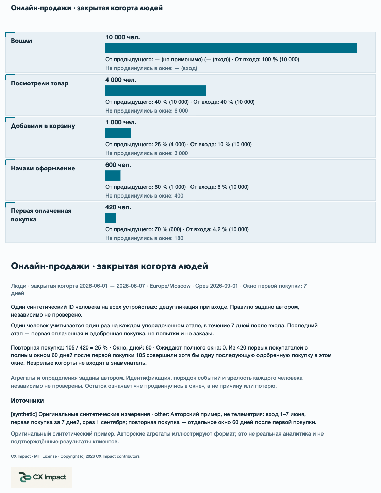
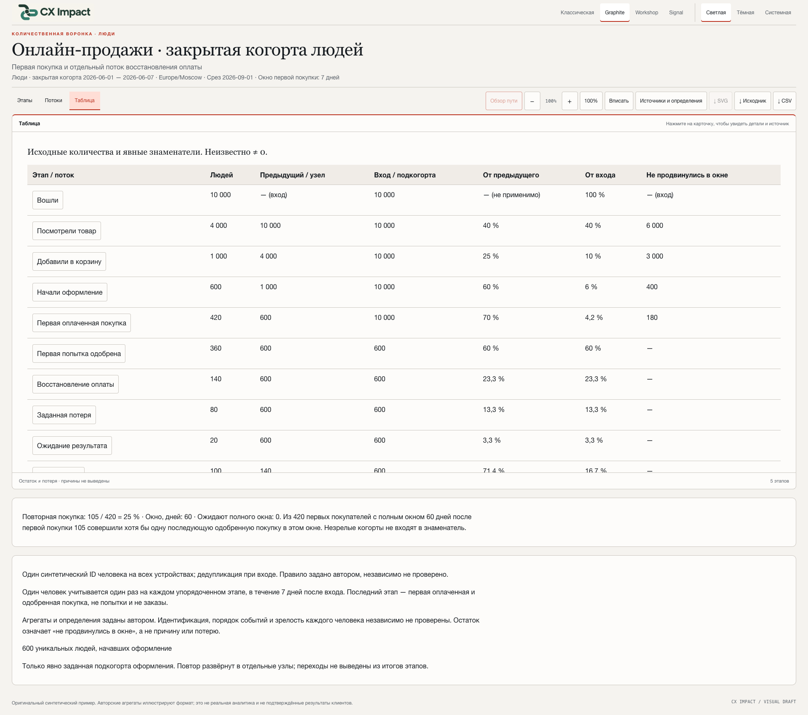
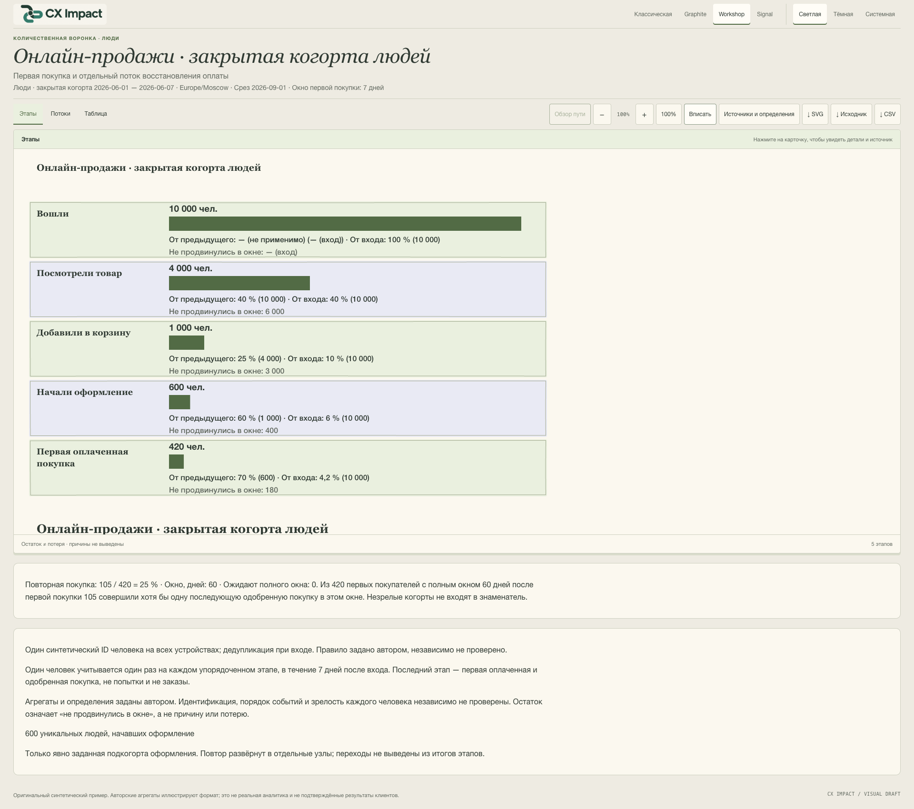

# CX Impact v0.6.0 — Сравнение сценариев и воронка продаж

[English](v0.6.0.en.md) · [Релиз и файлы](https://github.com/shelasmax/cx-impact/releases/tag/v0.6.0)

CX Impact объединяет опциональное сравнение AS IS / TO BE, отдельную количественную воронку продаж и четыре оформления в одном переносимом скилле. CJM, service blueprint и карты процесса-опыта продолжают работать. HTML открывается без сервера; у каждого результата сохраняются редактируемый JSON и автономный комплект исходников.

Все примеры ниже — оригинальные синтетические материалы. Изображения сняты в Chrome с работающего просмотрщика или его полного SVG-экспорта; это не промомакеты. Полные экспорты включают содержимое ниже видимой области холста. Снимки интерфейса сделаны при 1920×1080 с естественной прокруткой страницы; сам холст остаётся прокручиваемым. Нажмите на изображение для полного размера.

## AS IS / TO BE: показать, что меняется

Передайте агенту оба сценария и явные соответствия. Кнопка **Сравнить AS IS / TO BE** выравнивает этапы и участников во всех трёх видах карты. Один этап может разделяться на несколько целевых; элементы без соответствия остаются видимыми. Сопоставление по названиям или ID не придумывается. Детали сохраняют утверждения и источники каждой стороны, даже если у одинакового ID источника разный текст. Выключение сравнения возвращает обычный просмотр.

```text
$cx-impact Сравни текущий и предлагаемый сценарии оформления заказа.
Используй приложенные описания и явные соответствия этапов и узлов.
Сохрани неизвестные, изменения источников и разделение оплаты на два этапа.
Сохрани карту сравнения на русском и автономный комплект для пересборки.
```

Для русского интерфейса задайте `locale: "ru"` и подготовьте содержание карты на русском. Locale не переводит исходные материалы автоматически. [JSON сравнения](https://github.com/shelasmax/cx-impact/blob/v0.6.0/skills/cx-impact/examples/scenarios/online-sales.ru.json) · [Скачать HTML](https://github.com/shelasmax/cx-impact/releases/download/v0.6.0/comparison-ru.html).

### 1. Classic — полная парная CJM

Текущий и предлагаемый пути связаны явным выравниванием. Пустые позиции и этапы без соответствия сохраняются. Это снимок полного SVG-экспорта.


### 2. Graphite — полный парный service blueprint

Типографика и разделители групп помогают читать действия клиента, видимую работу сервиса, внутренние операции и поддержку. Статусы утверждений и источники сохраняются. Снимок полного SVG.


### 3. Workshop — полный парный процесс

Тёплые поверхности и слегка неровные контуры групп подходят для обсуждения на воркшопе. Полные условия, предлагаемое восстановление и оба сценария остаются в экспорте. Снимок полного SVG.


### 4. Signal — интерфейс процесса в тёмном режиме

Чёткая иерархия, технические индексы и акцент на существующих маршрутах. На снимке — интерфейс и видимая часть прокручиваемого парного процесса. Прохождение пути включается отдельно, останавливается перед выбором ветви и не изображает скорость трафика. Смена оформления останавливает прохождение.



## Воронка продаж: числа, знаменатели и заданное восстановление

Новый документ `kind: "sales-funnel"` создаётся отдельно от карты пути. Первая версия контракта считает уникальных людей в закрытой упорядоченной когорте. Нужно определить даты когорты, дату среза, часовой пояс, окно конверсии, правила идентификации и порядка событий. У каждого этапа есть число или явное неизвестное и источники. Остаток означает «не продвинулись за окно», а не доказанную потерю или её причину.

В синтетическом примере: 10 000 посетителей → 4 000 взаимодействий с товаром → 1 000 корзин → 600 оформлений → 420 первых покупателей. Конверсия оформления — 420/600 = 70%, от входа до покупки — 420/10 000 = 4,2%. Отдельно заданный граф восстановления даёт баланс: 420 продвинулись, 150 потеряны, 20 ожидают, 10 неизвестны. Повторная покупка — 105/420 = 25% по зрелой когорте с окном 60 дней.

```text
$cx-impact Построй воронку онлайн-продаж по приложенным числам и определениям.
Покажи конверсию этапов, заданные потери, ожидающие и неизвестные исходы.
Используй только предоставленные переходы; разверни повторные попытки оплаты.
Считай повторную покупку по отдельному зрелому знаменателю. Сохрани HTML, JSON и CSV.
```

### 5. Signal — этапы и конверсии

Ширина полос, числа и доли рассчитываются по одним проверенным данным. Показаны знаменатели от входа и от предыдущего этапа; пропущенное значение не превращается в ноль. Снимок полного SVG.



### 6. Signal — потоки восстановления оплаты

Ленты следуют измеренным переходам и используют единый масштаб. Повторные попытки заданы отдельными узлами; граф не выводится из суммарных чисел этапов. Пересечение лент само по себе не означает соединение. Снимок полного SVG.


### 7. Graphite — таблица чисел

Таблица показывает исходные числа и знаменатели для обсуждения. CSV экранируется и защищает авторский текст от формул электронных таблиц. SVG доступен для «Этапов» и «Потоков»; для «Таблицы» предназначен CSV.



### 8. Workshop — та же воронка в другом оформлении

Во всех дизайнах используются те же числа и геометрия. Classic, Graphite, Workshop и Signal выбираются независимо от светлого, тёмного или системного режима. На снимке — прокручиваемый интерфейс в масштабе «Вписать».



## Скачать и использовать

- [Пакет скилла](https://github.com/shelasmax/cx-impact/releases/download/v0.6.0/cx-impact-0.6.0.zip): распакуйте и скопируйте весь каталог `cx-impact/` в каталог навыков своего агента.
- [Автономная галерея](https://github.com/shelasmax/cx-impact/releases/download/v0.6.0/cx-impact-0.6.0-showcase.zip): распакуйте целиком и откройте `index.html`. Внутри оба языка, четыре интерактивных комплекта HTML/JSON/source, эти скриншоты и архив скилла.
- Отдельные примеры: [сравнение](https://github.com/shelasmax/cx-impact/releases/download/v0.6.0/comparison-ru.html), [воронка](https://github.com/shelasmax/cx-impact/releases/download/v0.6.0/funnel-ru.html). Сначала скачайте файл: просмотрщик GitHub показывает HTML-код, а не работающую карту.

Из каталога репозитория:

```sh
node skills/cx-impact/scripts/render-map.mjs --check skills/cx-impact/examples/funnels/online-sales.ru.json
node skills/cx-impact/scripts/render-map.mjs skills/cx-impact/examples/funnels/online-sales.ru.json output/funnel.html
node output/funnel.source/rebuild.mjs
```

Для рендеринга и пересборки нужен Node.js 18+, для просмотра — только браузер. Новых зависимостей исполнения, аккаунтов, сервера или сервиса рендеринга нет. [Установка и обновление](https://github.com/shelasmax/cx-impact/blob/v0.6.0/docs/installation.ru.md).

## Совместимость, проверки и ограничения

JSON карт сохраняет `version: 1`. Старые карты и собственные снимки исходников продолжают работать; старый рендерер не обязан понимать новый тип воронки. JSON-экспорт карты сохраняет все исходные значения; JSON воронки и соседние исходные файлы сохраняют точные байты. Полный статичный SVG содержит оформление, сведения об источниках, MIT и встроенный логотип.

Релиз проверяется тестами Node, списком разрешённых публикационных файлов, рендерингом и пересборкой извлечённого пакета и Chrome при 1366×900 и 1920×1080. Браузерная матрица охватывает оба языка, четыре дизайна и светлый/тёмный режимы; отдельные проверки — клавиатуру, экспорт, сравнение, восстановление и настройки. Точный [объём проверки](https://github.com/shelasmax/cx-impact/blob/v0.6.0/docs/verification.md).

В карте 2–12 этапов; заданный граф воронки ограничен 32 узлами и 48 рёбрами и может потребовать разбиения ради читаемости. Агрегаты не доказывают идентификацию людей, индивидуальную зрелость окна, причины потерь или финансовый эффект. Другие браузерные движки, экранные дикторы и человеческая смысловая приёмка не заявляются. Codex остаётся проверенной локальной средой агента.

Перед обновлением сохраните установленный пакет и существующие комплекты карт. Для отката восстановите каталог или предыдущий архив v0.5.0. Прежние теги и файлы релизов остаются доступны.
