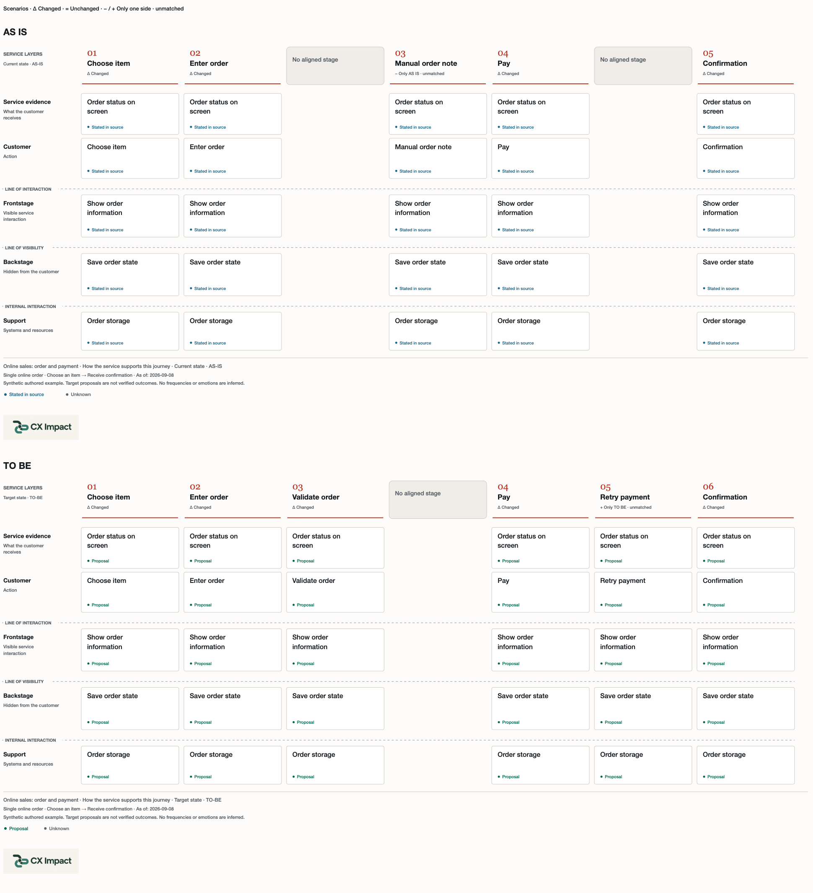
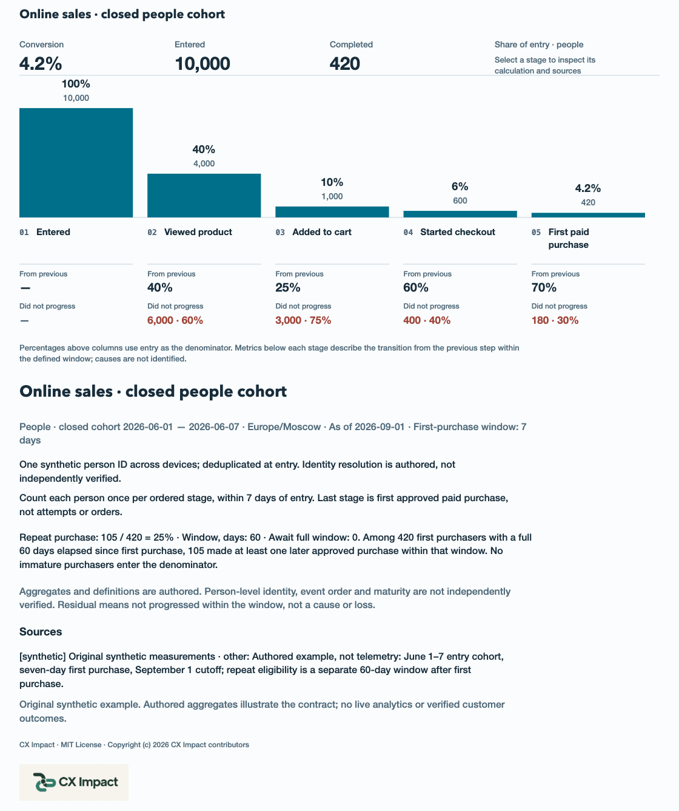
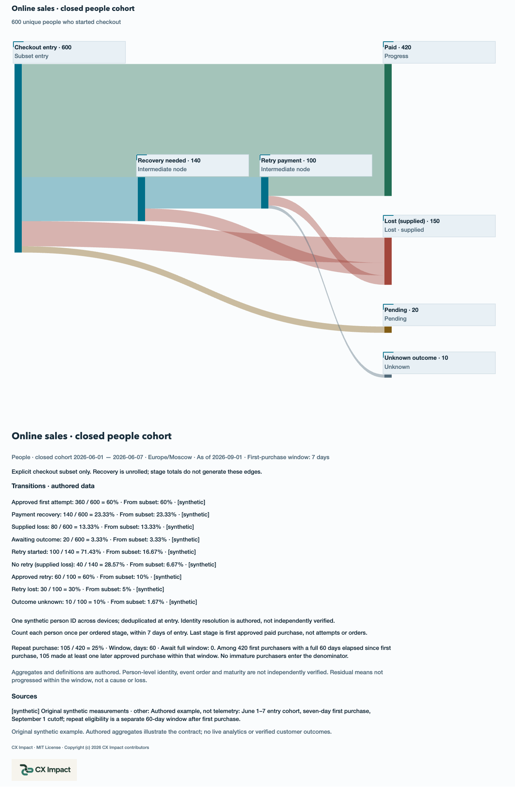
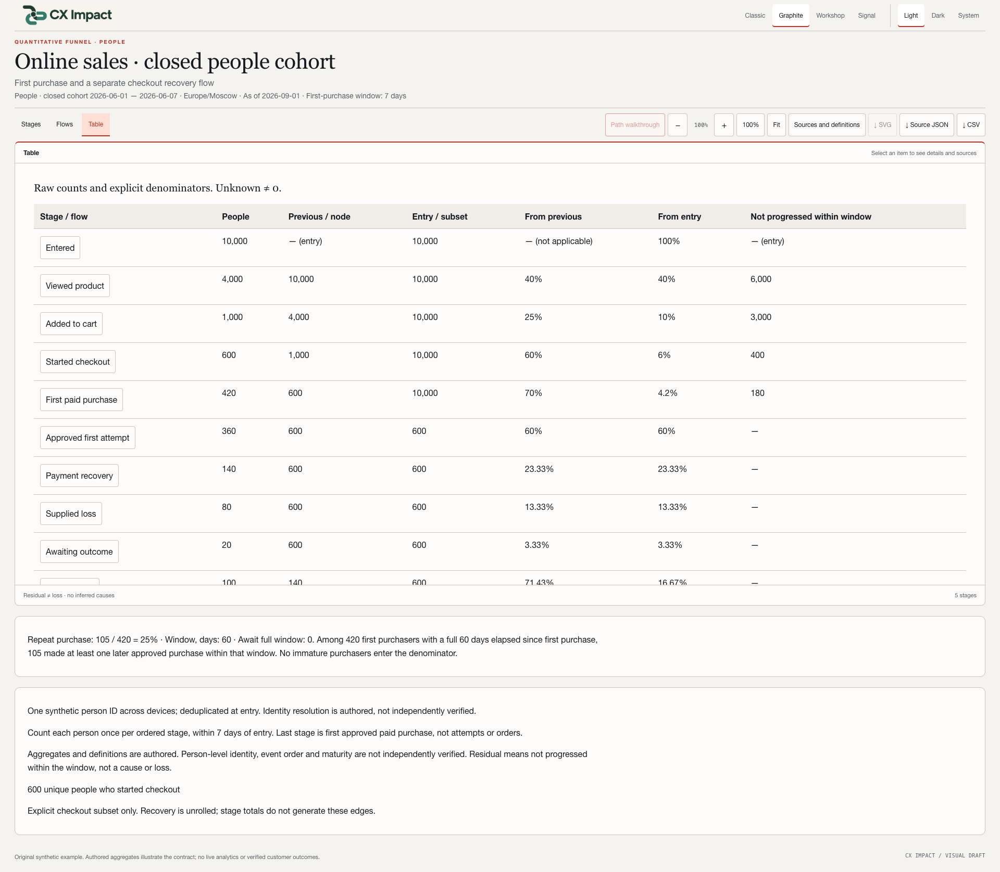
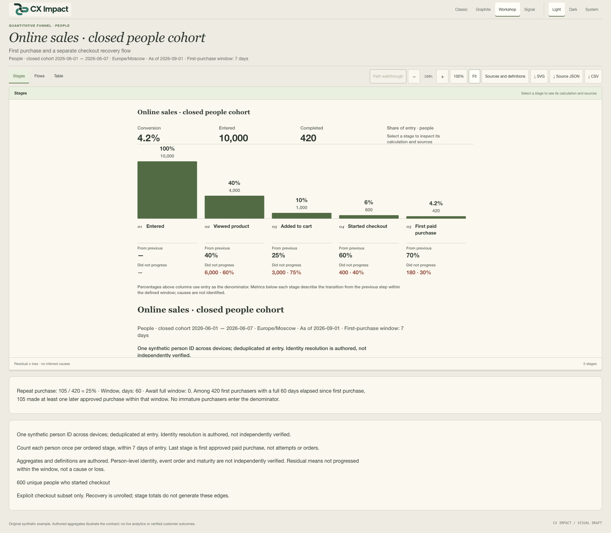

# CX Impact — See the service. Understand the conversion.

[Русский](v0.6.1.ru.md) · [Release and downloads](https://github.com/shelasmax/cx-impact/releases/tag/v0.6.1)

CX Impact is a portable agent skill for product managers, analysts, designers and service teams. It turns descriptions, requirements, research and process documents into customer journeys, service blueprints and experience-process maps. Optional AS IS / TO BE comparison makes proposed changes explicit. A separate sales funnel turns supplied counts and definitions into stage conversions, recovery flows and a numerical table.

The result is an interactive HTML file you can open and share without a server. Editable JSON, full SVG exports and a complete source snapshot keep it reusable; funnels also export CSV. Sources, requirements, observations, hypotheses, proposals and unknowns remain distinguishable.

## Customer journey, service operations and process

A **CJM** organizes goals, actions, touchpoints, experience evidence, barriers and proposals by stage. A **service blueprint** aligns customer-facing work, backstage operations and support with that journey. An **experience-process map** shows who acts, what gets handed over, what conditions determine the next step and how recovery works. All three views refer to the same scenario and stable IDs.

```text
$cx-impact Create a CJM, service blueprint and experience-process map
from the attached product documents. Use English content and interface.
Keep requirements, observations, hypotheses and unknowns distinct.
Show full decision conditions and recovery. Save HTML and rebuildable sources.
```

Choose a current state or target state. When both matter, supply the two scenarios and explicit correspondences, then enable **Compare AS IS / TO BE**. Splits and unmatched elements remain visible; each side retains its own claims and sources. Turning comparison off restores ordinary viewing. The paired SVG contains both scenarios in a complete stacked layout.

### Customer journeys · Classic

The current and proposed journeys use explicit stage alignment. This is a complete exported SVG capture.


### Service blueprints · Graphite

The customer, visible service, backstage work and supporting systems are aligned to the same stages. Complete paired SVG capture.



### Processes and recovery · Workshop

Participants, handoffs, full branch conditions and proposed recovery are retained in both scenarios. Complete paired SVG capture.


### Reading and presenting a process · Signal

The dark interface shows the visible portion of a scrollable comparison. A path walkthrough is optional, starts off and pauses for a branch choice. It is a reading aid, not a simulation of traffic or elapsed time.


[Download the interactive map and comparison](https://github.com/shelasmax/cx-impact/releases/download/v0.6.1/comparison-en.html) · [Editable scenario JSON](https://github.com/shelasmax/cx-impact/blob/v0.6.1/skills/cx-impact/examples/scenarios/online-sales.en.json)

## Sales funnel: stages, conversion and recovery

Supply unique-person counts, cohort dates, cutoff, timezone, conversion window, identity rule and order rule. Equal-width columns share a zero baseline; their heights show the share of the entry cohort. The summary presents overall conversion, entry and exit. Each stage shows its count and share of entry, conversion from the previous step and those who did not progress within the defined window. Tiny values keep their proportions; missing values remain unknown.

The original synthetic example is **10,000 → 4,000 → 1,000 → 600 → 420 people**. Entry-to-first-purchase conversion is 4.2%; checkout-to-purchase is 70%. These are demonstration counts, not customer outcomes.

```text
$cx-impact Build an online-sales funnel from the attached counts and definitions.
Show stage conversion and people who did not progress within the window.
Use only the supplied transitions for payment recovery and explicitly classified losses.
Keep repeat purchase on its own mature denominator. Export HTML, JSON and CSV.
```

### Stage counts and conversion · Signal

The column chart places the first-to-last summary above the stages and adjacent-step metrics below. Names wrap in full. Positive rates below 0.01% are labelled explicitly rather than rounded to zero. Complete SVG capture.



### Payment recovery flows · Signal

A separately supplied flow graph shows payment retries and final outcomes. Ribbons share a quantitative scale; retry nodes are explicitly unrolled. The example balances 420 progressed, 150 classified as lost, 20 pending and 10 unknown within the 600-person checkout subset. These flows are not inferred from differences between stage totals. Crossing ribbons are not implicit joins. Complete SVG capture.



### Counts and denominators · Graphite

The table exposes raw counts and the denominator behind each ratio. CSV retains raw values and quotes authored text with spreadsheet-formula mitigation. SVG is available for Stages and Flows; export the Table through CSV.



### The same data in another design · Workshop

Classic, Graphite, Workshop and Signal preserve the same values and geometry. Each supports Light, Dark and System modes. This interface capture shows the funnel at Fit; the canvas remains scrollable.



Repeat purchase is a separate module with a mature eligible denominator. The example has 105 repeat purchasers out of 420 people with a complete 60-day window, or 25%. Pending maturation stays separate.

[Download the interactive funnel](https://github.com/shelasmax/cx-impact/releases/download/v0.6.1/funnel-en.html) · [Editable funnel JSON](https://github.com/shelasmax/cx-impact/blob/v0.6.1/skills/cx-impact/examples/funnels/online-sales.en.json)

## Create, share and update

Install from your project directory, then start a fresh agent session:

```sh
npx skills add shelasmax/cx-impact --skill cx-impact
```

Use `$cx-impact` in Codex. Manual installation: extract the [skill package](https://github.com/shelasmax/cx-impact/releases/download/v0.6.1/cx-impact-0.6.1.zip) and copy the whole `cx-impact/` directory to your agent’s skill location. Node.js 18+ is needed to render or rebuild; viewing needs only a browser. The renderer has no runtime dependencies, server, account or external rendering service. Agent creation still uses your configured model provider.

The [offline showcase](https://github.com/shelasmax/cx-impact/releases/download/v0.6.1/cx-impact-0.6.1-showcase.zip) contains both language guides, 16 screenshots, two product overview images, four standalone map/funnel demos with exact JSON and `.source/` bundles, and the skill package. Extract it and open `index.html`. Direct HTML files must be downloaded for interaction; GitHub shows their source.

Every delivery contains HTML, editable JSON, structural/geometry diagnostics and a source snapshot with `rebuild.mjs`. Inspect a stage or flow by click or keyboard; Escape restores focus. Use natural 100% to read and Fit to overview. Static SVG retains the selected design, source metadata, MIT notice and embedded logo. Funnel JSON downloads preserve exact source bytes.

To update a map, give the agent the previous JSON and new material. Ask it to preserve unchanged IDs, list changes and unresolved contradictions, and save a separate bundle. Before upgrading, keep the installed package and custom map snapshots. Roll back by restoring the prior installation or a previous release archive.

[Installation and upgrades](https://github.com/shelasmax/cx-impact/blob/v0.6.1/docs/installation.md) · [First-use examples](https://github.com/shelasmax/cx-impact/blob/v0.6.1/skills/cx-impact/references/quickstart.md)

## Evidence and support boundaries

All gallery images are actual Chrome captures of original synthetic examples. Complete SVG images include content below the visible canvas; interface captures use 1920×1080 and preserve natural scrolling. The homepage overview composes real excerpts without retouching chart contents.

CX Impact is an experimental public product. Authored aggregates cannot independently prove identity, event ordering or individual cohort maturity. A stage residual means “not progressed within the window”; it does not establish loss, cause or financial impact. Code cannot establish customer emotions or issue frequency. Requirements and proposals keep their status across views.

Input remains `version: 1`. Maps support 2–12 stages; funnel flows support up to 32 nodes and 48 edges. Large scenarios may need to be split for readability. This is not a visual editor or a complete BPMN tool. Codex is the tested local agent target; other agent support is described in the installation guide.

Verification includes 63 Node tests, publication integrity, extracted-package/rebuild checks, the dedicated 192-case funnel matrix and the broader 64-configuration/36-legacy-state browser suite at 1366×900 and 1920×1080. Chrome on macOS is the tested browser; other engines, screen readers and human semantic acceptance are not claimed. [Exact verification scope](https://github.com/shelasmax/cx-impact/blob/v0.6.1/docs/verification.md) · [Changelog](https://github.com/shelasmax/cx-impact/blob/v0.6.1/CHANGELOG.md)
