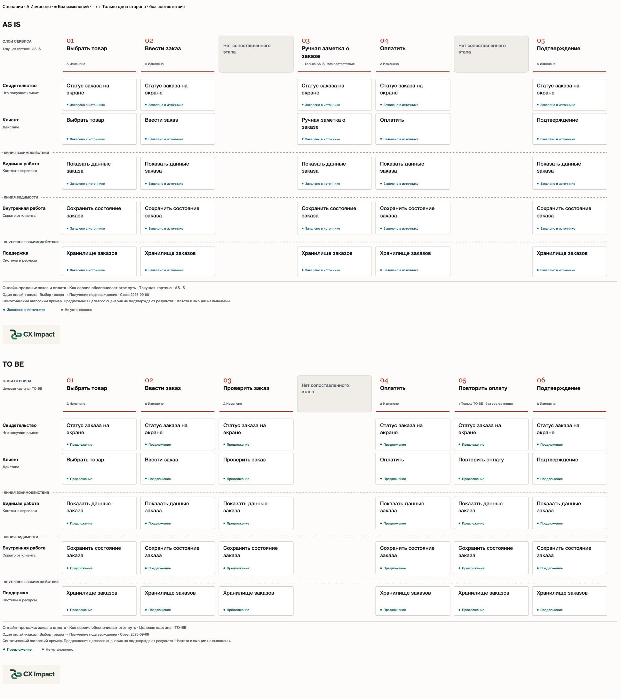
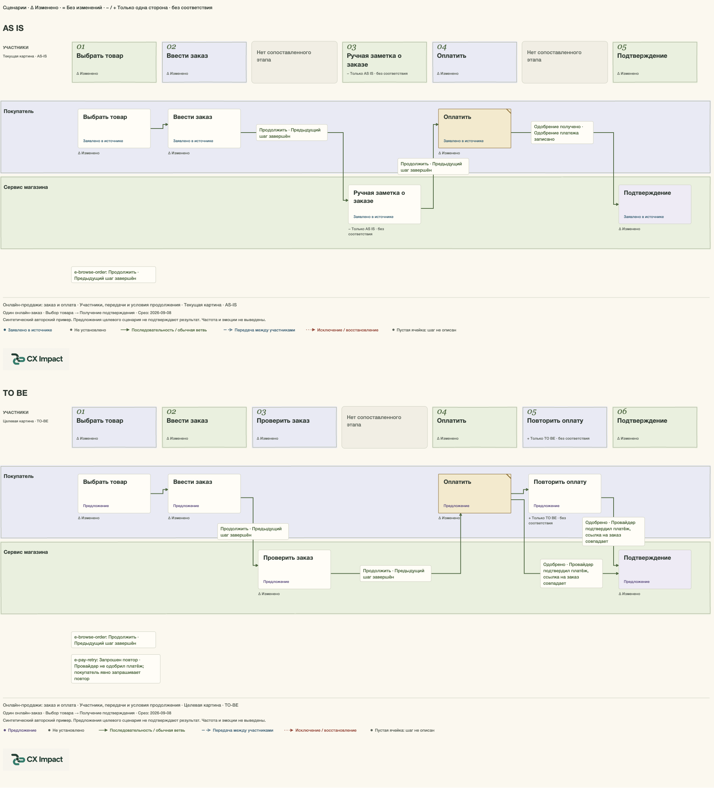
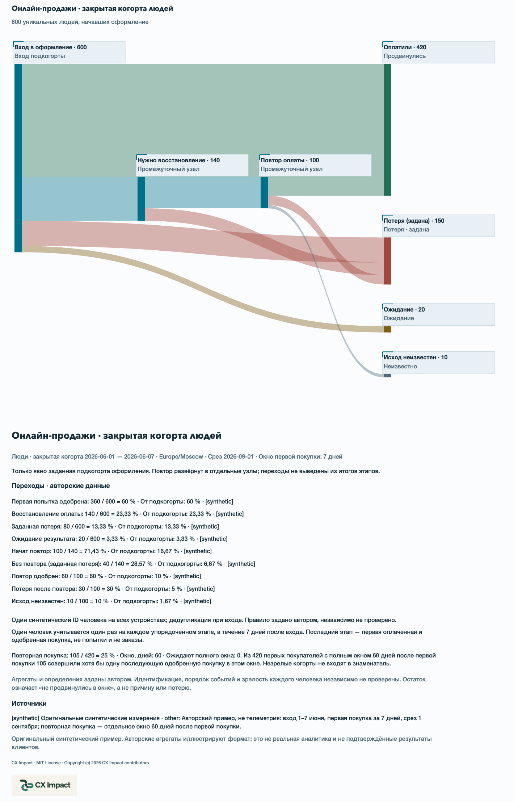
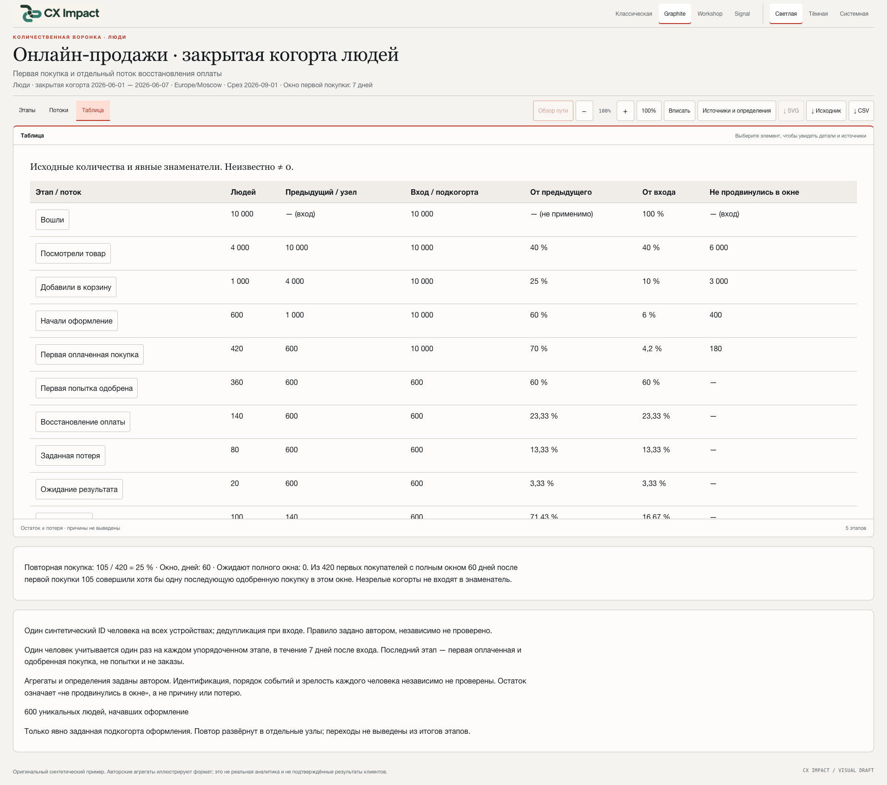
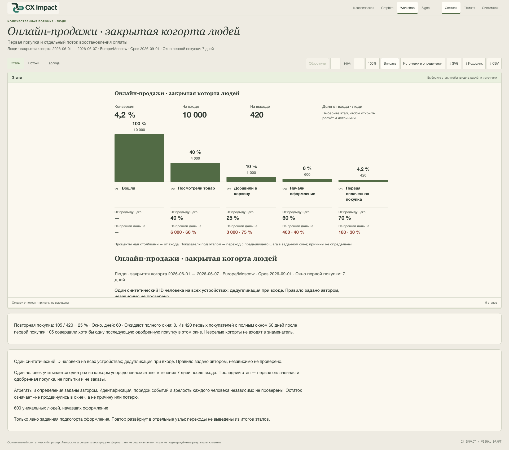

# CX Impact — Видеть сервис. Понимать конверсию.

[English](v0.6.1.en.md) · [Релиз и файлы](https://github.com/shelasmax/cx-impact/releases/tag/v0.6.1)

CX Impact — переносимый скилл для продактов, аналитиков, дизайнеров и сервисных команд. Он превращает описания, требования, исследования и документы процессов в карты пути клиента, сервисные схемы и карты процесса-опыта. Необязательное сравнение AS IS / TO BE показывает предлагаемые изменения. Отдельная воронка продаж превращает заданные числа и определения в конверсии этапов, потоки восстановления и таблицу.

Результат — интерактивный HTML, который можно открыть и передать без сервера. Редактируемый JSON, полный SVG и комплект исходников позволяют использовать его повторно; у воронки также есть CSV. Источники, требования, наблюдения, гипотезы, предложения и неизвестные остаются различимыми.

## Путь клиента, работа сервиса и процесс

**CJM** связывает этапы с целями, действиями, точками контакта, сведениями об опыте, барьерами и предложениями. **Сервисная схема** добавляет видимую клиенту работу, внутренние операции и поддержку. **Карта процесса-опыта** показывает участников, передачи, условия следующего шага и восстановление. Все три представления опираются на один сценарий и стабильные ID.

```text
$cx-impact Создай CJM, сервисную схему и карту процесса-опыта
по приложенным документам продукта. Содержание и интерфейс — на русском.
Разделяй требования, наблюдения, гипотезы и неизвестные.
Покажи полные условия решений и восстановление. Сохрани HTML и исходники.
```

Выберите текущий или целевой сценарий. Если нужны оба, передайте их вместе с явными соответствиями и включите **Сравнить AS IS / TO BE**. Разделение элементов и элементы без пары остаются видимыми; у каждой стороны свои утверждения и источники. Выключение сравнения возвращает обычный просмотр. Парный SVG содержит обе схемы целиком, расположенные вертикально.

### Карты пути клиента · Classic

Текущий и предлагаемый пути связаны явным соответствием этапов. Снимок полного экспортированного SVG.


### Сервисные схемы · Graphite

Клиент, видимая работа сервиса, внутренние операции и поддержка связаны с теми же этапами. Снимок полного парного SVG.



### Процессы и восстановление · Workshop

Участники, передачи, полные условия ветвления и предлагаемые пути восстановления сохранены в обоих сценариях. Снимок полного парного SVG.



### Чтение и обсуждение процесса · Signal

Тёмный интерфейс показывает видимую часть прокручиваемого сравнения. Обзор пути включается отдельно, выключен при открытии и останавливается для выбора ветви. Это помощь при чтении, а не симуляция трафика или времени выполнения.


[Скачать интерактивную карту и сравнение](https://github.com/shelasmax/cx-impact/releases/download/v0.6.1/comparison-ru.html) · [Редактируемый JSON сценариев](https://github.com/shelasmax/cx-impact/blob/v0.6.1/skills/cx-impact/examples/scenarios/online-sales.ru.json)

## Воронка продаж: этапы, конверсия и восстановление

Передайте количества уникальных людей, даты когорты, срез, часовой пояс, окно конверсии и правила идентификации и порядка событий. Столбцы одинаковой ширины имеют общую нулевую линию; их высота показывает долю людей от входа. В сводке — общая конверсия, вход и выход. У каждого этапа — число и доля от входа, переход с предыдущего шага и не прошедшие дальше в заданном окне. Малые значения сохраняют пропорции; пропуски остаются неизвестными.

Оригинальный синтетический пример: **10 000 → 4 000 → 1 000 → 600 → 420 человек**. Конверсия из входа в первую покупку — 4,2%; из оформления в покупку — 70%. Это демонстрационные числа, а не результаты клиентов.

```text
$cx-impact Построй воронку онлайн-продаж по приложенным числам и определениям.
Покажи конверсии и не прошедших дальше в заданном окне.
Для восстановления оплаты и заданных потерь используй заданные переходы.
У повторной покупки оставь свой зрелый знаменатель. Экспортируй HTML, JSON и CSV.
```

### Количества и конверсии · Signal

Над столбцами — сводка от первого до последнего этапа, под ними — показатели соседних переходов. Названия переносятся полностью. Положительные доли меньше 0,01% отмечаются явно, а не округляются до нуля. Снимок полного SVG.


### Потоки восстановления оплаты · Signal

Отдельно заданный граф показывает повторные попытки оплаты и конечные исходы. Ленты имеют общий количественный масштаб; узлы повтора развёрнуты явно. В примере из 600 начавших оформление 420 продвинулись, 150 составили заданные потери, 20 ожидают и у 10 исход неизвестен. Потоки не выводятся из разностей между суммами этапов. Пересечение лент не означает соединение. Снимок полного SVG.



### Числа и знаменатели · Graphite

Таблица показывает исходные количества и основание каждой доли. CSV сохраняет исходные значения, заключает текст в кавычки и нейтрализует формулы в авторском тексте. SVG доступен в «Этапах» и «Потоках»; для таблицы используйте CSV.



### Те же данные в другом оформлении · Workshop

Classic, Graphite, Workshop и Signal сохраняют одинаковые числа и геометрию. У каждого есть светлый, тёмный и системный режимы. Снимок интерфейса показывает воронку в масштабе «Вписать»; холст остаётся прокручиваемым.



Повторная покупка — отдельный модуль со зрелым знаменателем. В примере 105 повторных покупателей из 420 человек с завершённым 60-дневным окном, или 25%. Ожидающие полного окна учитываются отдельно.

[Скачать интерактивную воронку](https://github.com/shelasmax/cx-impact/releases/download/v0.6.1/funnel-ru.html) · [Редактируемый JSON воронки](https://github.com/shelasmax/cx-impact/blob/v0.6.1/skills/cx-impact/examples/funnels/online-sales.ru.json)

## Создавать, делиться и обновлять

Установите скилл из папки проекта, затем начните новую сессию агента:

```sh
npx skills add shelasmax/cx-impact --skill cx-impact
```

В Codex используйте `$cx-impact`. Для ручной установки распакуйте [пакет скилла](https://github.com/shelasmax/cx-impact/releases/download/v0.6.1/cx-impact-0.6.1.zip) и скопируйте каталог `cx-impact/` целиком в папку скиллов агента. Node.js 18+ нужен для создания и пересборки, для просмотра — только браузер. Рендерер не требует дополнительных runtime-зависимостей, сервера, аккаунта или внешнего сервиса отрисовки. Создание агентом использует выбранного провайдера модели.

[Автономный комплект](https://github.com/shelasmax/cx-impact/releases/download/v0.6.1/cx-impact-0.6.1-showcase.zip) содержит описания на двух языках, 16 скриншотов, два обзорных изображения продукта, четыре автономных примера карт и воронок с точными JSON и папками `.source/`, а также пакет скилла. Распакуйте его и откройте `index.html`. Отдельные HTML нужно скачать для интерактивного просмотра; GitHub показывает их код.

Каждый результат содержит HTML, редактируемый JSON, диагностику структуры и геометрии и снимок исходников с `rebuild.mjs`. Этап или поток открывается мышью и клавиатурой; Escape возвращает фокус. Масштаб 100% предназначен для чтения, «Вписать» — для обзора. Статический SVG сохраняет оформление, источники, уведомление MIT и встроенный логотип. JSON воронки скачивается с точными исходными байтами.

Для обновления карты передайте агенту предыдущий JSON и новые сведения. Попросите сохранить неизменившиеся ID, перечислить изменения и противоречия и создать отдельный комплект. Перед обновлением скилла сохраните прежнюю установку и пользовательские снимки карт. Откат — восстановление предыдущей установки или архива релиза.

[Установка и обновление](https://github.com/shelasmax/cx-impact/blob/v0.6.1/docs/installation.ru.md) · [Примеры первого использования](https://github.com/shelasmax/cx-impact/blob/v0.6.1/skills/cx-impact/references/quickstart.ru.md)

## Основания и границы поддержки

Все изображения галереи — реальные снимки Chrome на оригинальных синтетических примерах. Полные SVG включают содержимое ниже видимого холста; снимки интерфейса сделаны на 1920×1080 с естественной прокруткой. Обзорная картинка на главной собрана из реальных фрагментов без ретуши содержимого диаграмм.

CX Impact — экспериментальный публичный продукт. Заданные агрегаты не доказывают корректность идентификации, порядка событий и индивидуальной зрелости когорты. Остаток этапа означает «не продвинулись в окне» и сам по себе не устанавливает потерю, причину или финансовый эффект. Код не подтверждает переживания клиентов и частоту проблем. Требования и предложения сохраняют статус между видами.

Формат входа остаётся `version: 1`. Карты поддерживают 2–12 этапов; граф воронки — до 32 узлов и 48 переходов. Большие сценарии может потребоваться разделить для читаемости. Это не визуальный редактор и не полная реализация BPMN. Codex — проверенная локальная среда агента; поддержка остальных описана в инструкции установки.

Проверки включают 63 Node-теста, контроль состава публикации, извлечение и пересборку пакета, отдельную матрицу воронки из 192 случаев и общую браузерную проверку 64 конфигураций и 36 состояний прежних карт на 1366×900 и 1920×1080. Проверенный браузер — Chrome на macOS; другие движки, скринридеры и смысловая приёмка человеком не заявлены. [Точный объём проверок](https://github.com/shelasmax/cx-impact/blob/v0.6.1/docs/verification.md) · [История изменений](https://github.com/shelasmax/cx-impact/blob/v0.6.1/CHANGELOG.md)
